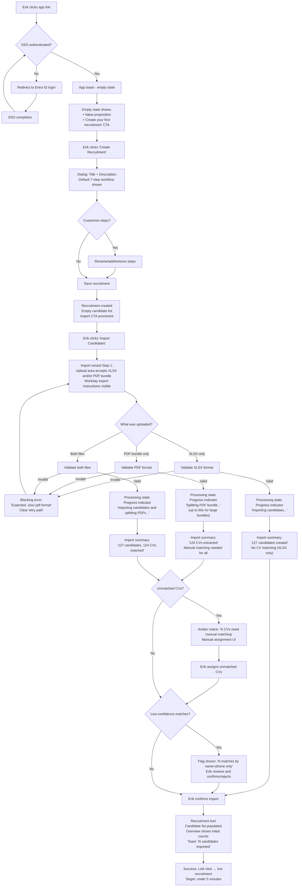
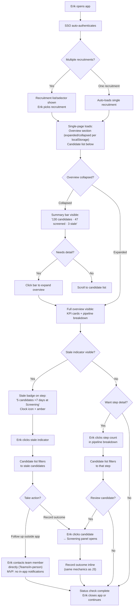
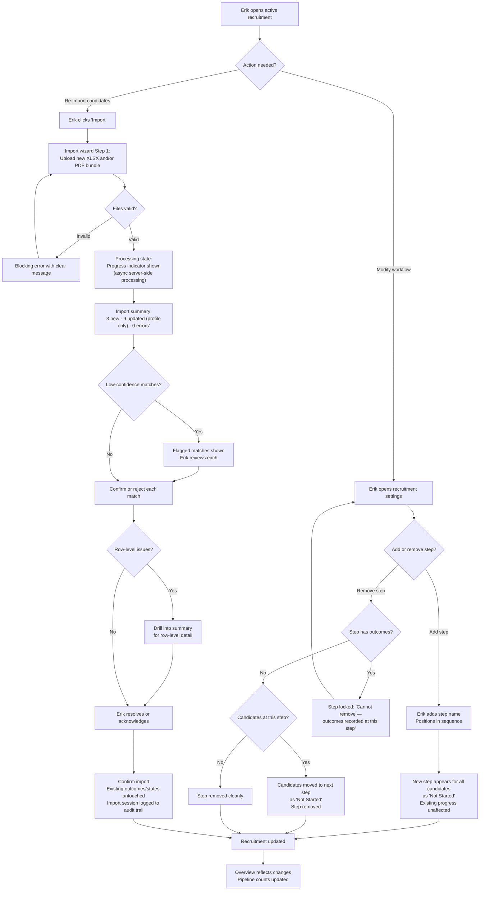
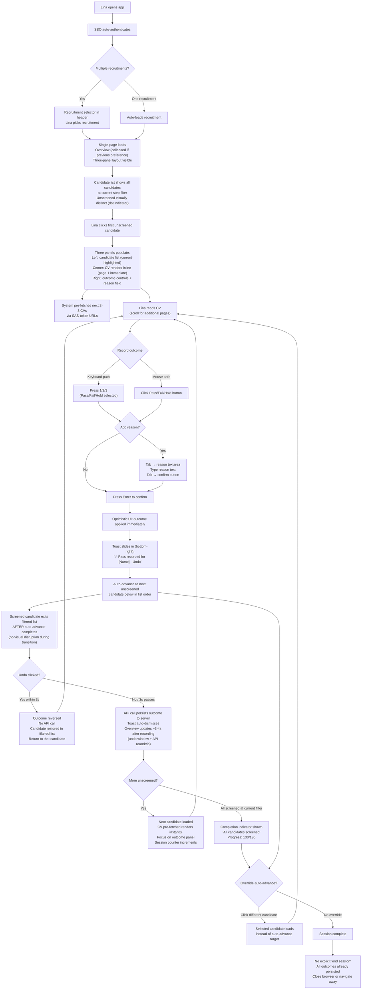
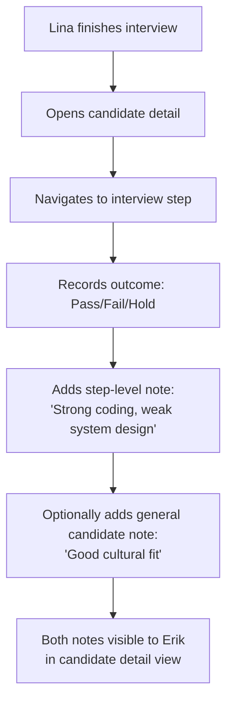
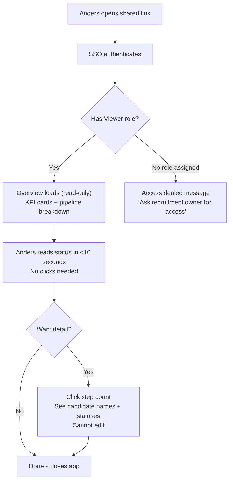
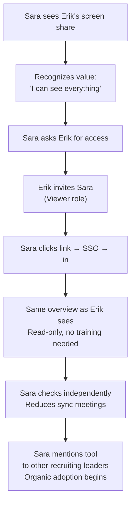

# UX Design Specification recruitment-tracker

**Author:** MrGyllen
**Date:** 2026-02-04

---

## Executive Summary

### Project Vision

recruitment-tracker is a focused execution companion for hiring teams, filling the gap between Workday (system of record) and the day-to-day work of running a recruitment. The core UX promise is "the team collaborates without the leader as bottleneck" -- replacing manual information relay via Teams/email/spreadsheets with a shared status board where every participant self-serves.

The application is desktop-first (1280px minimum viewport), targets Edge and Chrome, and uses Microsoft Entra ID SSO for zero-friction onboarding. It is not an HR system, not a project management tool, and not a Workday replacement. Every UX decision must pass the filter: "Does this help run the hiring?"

### Target Users

**Erik (Recruiting Leader)** -- Line manager running 2-3 recruitments per year alongside regular leadership duties. Comfortable with standard business tools but has zero patience for complex systems. If it takes more than a few clicks, he'll fall back to Teams. Design principle: "Every screen answers: what needs my attention?"

**Lina (SME/Collaborator)** -- Senior engineer pulled in for technical assessment. Recruitment is not her primary job. Very tech-savvy but demands efficiency -- the app must be faster and simpler than the Teams chat it replaces. Design principle: "Complete your task in one focused session."

**Anders (Viewer)** -- Stakeholder who wants pipeline visibility without asking anyone. Needs the full picture in under 10 seconds without clicking into details. Design principle: "Glance and know."

**Sara (HR Partner, future)** -- RBAC role defined, no features built. The goal is to build something so useful that Sara asks to be included. Design principle: "Build pull, don't push adoption."

### Key Design Challenges

1. **Batch screening at scale** -- The split-panel layout (candidate list + PDF viewer + outcome form) must keep Lina in flow across 130+ candidates with keyboard-first navigation, zero page reloads, and PDF pre-fetching. This is the hardest UX problem and the make-or-break adoption moment for SMEs.

2. **Import flow complexity** -- Multi-step process (XLSX + PDF bundle upload, matching review, manual assignment) that must feel simple despite significant backend complexity. Erik does this infrequently, so the UX must guide rather than assume learned behavior.

3. **Information density without overwhelm** -- The overview dashboard serves three different "glance and know" needs: Erik's "what needs my attention?", Lina's "what's assigned to me?" (Growth), and Anders' "where does the pipeline stand?". Balancing density with clarity across these use cases is critical.

4. **Empty state as onboarding** -- Erik's first experience is an empty application. The empty state must serve as onboarding-quality guidance, taking him from zero to a live recruitment with imported candidates in under 5 minutes.

### Design Opportunities

1. **Keyboard-first screening as power-user differentiator** -- If the batch screening flow lets Lina screen candidates faster than downloading CVs from Teams and reporting back in chat, the app becomes indispensable. Target: 4 candidates in under 10 minutes including CV review.

2. **Visual pipeline clarity for organic adoption** -- A well-designed overview with per-step counts, stale indicators (shape+icon, not color-only per WCAG), and health status makes recruitment status instantly shareable. This is the mechanism for Sara's organic adoption: Erik shares his screen, Sara sees everything in 10 seconds, and asks for access.

3. **Progressive disclosure in import flow** -- Wizard-style import with clear steps (upload, review matches, confirm) hides complexity while surfacing manual intervention points (low-confidence matches, unmatched CVs) only when needed.

## Core User Experience

### Defining Experience

The core experience of recruitment-tracker shifts across the recruitment lifecycle, but two interactions define its value:

**Primary loop (early recruitment): Batch CV screening**
Erik imports candidates. Lina opens the app, sees her screening queue, and enters a focused flow: candidate list on the left, CV viewer in the center, outcome controls on the right. She reads a CV, records Pass/Fail/Hold with a brief reason, and the next candidate loads with a brief visual confirmation transition (~300ms) before auto-advancing. No file downloads, no switching between Teams and Excel, no reporting back via chat. The screening session IS the documentation.

**Primary loop (ongoing recruitment): Status check and alignment**
Any team member -- Erik, Lina, or Anders -- opens the overview. Per-step candidate counts tell them where the pipeline stands. Stale indicators flag candidates stuck too long at a step. Everyone sees the same truth at the same time, eliminating the need for synchronous status meetings. The app replaces "let me schedule a meeting so everyone has the same information" with a shared, always-current status board accessible to all roles.

**The core action that everything depends on: outcome recording.** Every meaningful state change in the system flows through a single interaction -- selecting an outcome (Pass/Fail/Hold) and optionally writing a reason. If this interaction is fast and frictionless, screening sessions flow, status stays current, and the overview stays accurate. If it's slow or cumbersome, users fall back to Teams.

### Platform Strategy

- **Desktop-first web application** -- 1280px minimum viewport width, optimized for laptop/desktop screens
- **Mouse and keyboard interaction** -- keyboard shortcuts for power users (outcome recording, candidate navigation), mouse for everything else
- **Keyboard shortcut mapping** -- `1`/`2`/`3` for Pass/Fail/Hold, `Tab` to move focus to reason field, `Enter` to confirm and advance. Chosen to avoid conflicts with browser defaults and accessibility tools
- **Target browsers**: Microsoft Edge (primary, corporate standard), Chrome (secondary)
- **No offline requirement** -- users are always on corporate network
- **Authentication**: Microsoft Entra ID SSO -- zero-friction entry, no separate credentials
- **PDF viewing**: In-app PDF renderer for CV display -- eliminating the download-open-read-close cycle is the single biggest friction reduction over the current process
- **No mobile requirement** -- recruitment work happens at desks, not on phones

### Effortless Interactions

These interactions must feel instant and require zero cognitive overhead:

1. **Outcome recording** -- Select Pass/Fail/Hold, optionally type a reason, done. One interaction, candidate advances. The reason field is always visible (not hidden behind an "add note" button) -- visible fields get used, hidden fields get ignored. This is what makes "the app is the documentation" work. Keyboard shortcuts (`1`/`2`/`3`, `Tab`, `Enter`) enable power-user throughput.

2. **Next candidate in screening** -- After recording an outcome, a brief confirmation transition (~300ms) acknowledges the action before the next candidate loads with their CV pre-fetched. The system pre-fetches the next 2-3 candidate CVs via SAS-token URLs while the current CV is being reviewed. No navigation, no clicking, no waiting for PDF render.

3. **Status comprehension** -- Opening the overview answers "where does the pipeline stand?" in a single glance for any role. No clicking into details, no mental math, no scrolling. Candidate counts per step, stale indicators, and pipeline health are all visible on first load. Every team member sees the same information -- this is what replaces the sync meeting.

4. **CV access** -- Click a candidate, see their CV. No download dialog, no file explorer, no waiting. The PDF renders inline. Scroll position is preserved per-candidate if the user navigates back. The split-panel divider is resizable so users can give the CV viewer more space for dense documents, and the preference persists across the session.

5. **SSO login** -- Corporate credentials, one click, you're in. No registration, no password setup, no email verification.

### Critical Success Moments

**Make-or-break moment #1: Lina's first screening session**
Lina opens the app for the first time, sees candidates assigned to her step, clicks one, and the CV appears inline. She records Pass with a reason, and the next candidate loads after a brief confirmation. If she thinks "I didn't have to download anything, and my assessment is already documented" -- adoption succeeds. The speed gain isn't in reading CVs faster; it's in eliminating the overhead around the reading: no downloads, no app-switching, no reporting back via Teams.

**Make-or-break moment #2: Erik checks status without scheduling a meeting**
Erik opens the overview after Lina has screened a batch. He can see how many candidates passed, how many are waiting for the next step, who's been idle too long. He knows what to do next without asking anyone. This is the moment where the app proves it replaces the "let me get everyone on a call to align" pattern.

**Make-or-break moment #3: Everyone sees the same truth**
Anders opens the overview from a link Erik shared. Lina opens the app to start her next screening session and glances at the overview first. They all see the same candidate counts, the same pipeline state, the same stale indicators. No one needs to ask "where are we?" -- the app answers it for every role. This is the core value that eliminates the fragile, meeting-dependent alignment of the current process.

**First-time success: Erik's initial import**
Erik's first action is importing candidates. If the XLSX upload, PDF matching, and candidate creation flow takes under 5 minutes and he can verify the results make sense, he trusts the system. If matching is confusing or requires too many manual corrections, he questions whether the app is worth the setup effort.

### Experience Principles

1. **Screening flow eliminates overhead, not reading time** -- The SME reads a CV at the same speed regardless of tool. What the app eliminates is everything around the reading: downloading files, switching apps, reporting back via chat, updating spreadsheets. Every design decision for the screening flow minimizes this overhead: inline PDFs, pre-fetching, visible reason field, keyboard shortcuts, auto-advance with confirmation.

2. **Status should be self-evident to every role** -- No one should ever need to schedule a meeting to ask "where do we stand?" The overview exists so that question never gets asked, regardless of whether you're the recruiting leader, the SME, or the stakeholder. Same data, same view, same truth. This is the feature that replaces synchronous alignment meetings.

3. **The app is the documentation** -- Every outcome recorded, every reason written, every status change captured. The act of using the app IS the act of documenting the recruitment. There is no separate "update the tracker" step. The freeform reason field on outcomes is the MVP documentation mechanism -- if during testing it proves insufficient, that's the signal to promote richer notes to the next phase.

4. **Zero-friction entry, zero-friction action** -- SSO gets you in, one click shows the CV, one interaction records the outcome. The reason field is visible by default, not hidden. Every additional click, modal, or confirmation dialog is a failure of design. The default path should require the minimum possible interactions.

5. **Guide infrequent users, empower power users** -- Erik imports candidates twice a year (guided wizard). Lina screens 130 candidates in a session (keyboard shortcuts, auto-advance). The same app serves both usage patterns without either feeling patronized or neglected.

## Desired Emotional Response

### Primary Emotional Goals

**Erik (Recruiting Leader): Relief and control**
The dominant emotion is relief -- "I don't have to chase people for updates anymore." Erik should feel in control of the recruitment without being the bottleneck. He sees the pipeline, trusts that outcomes are being recorded by his team, and focuses his energy on decisions (who to interview, who to offer) rather than information relay. The app removes the anxiety of "does everyone have the right information?"

**Lina (SME/Collaborator): Efficiency and professionalism**
Lina should feel both "that was quick" AND "my work is properly documented." These aren't competing emotions -- the screening flow should make her feel like a professional doing thorough work efficiently, not like she's rushing through a checkbox exercise. When she closes the app after a screening session, the feeling is: "I'm done. No follow-up emails, no 'can you send me your notes.' It's all in there."

**Anders (Viewer): Confidence and independence**
Anders should feel informed and self-sufficient. He opens the overview and immediately knows where the recruitment stands -- no anxiety about being out of the loop, no dependence on Erik scheduling an update meeting. The emotion is quiet confidence: "I know what's happening."

**The team as a whole: Shared momentum**
Beyond individual emotions, the app should create a collective feeling of progress. When Lina finishes screening and Erik opens the overview and sees "Lina screened 47 candidates today," the team emotion is "we're making progress together without having to coordinate." Showing who recorded outcomes (not just that they were recorded) reinforces this shared momentum and makes contributions visible.

### Emotional Journey Mapping

| Stage | Erik | Lina | Anders |
|-------|------|------|--------|
| **First open** | Curiosity → "this looks manageable" | Neutral → "ok, what do I need to do?" | Interest → "I can see everything already?" |
| **First import** | Mild anxiety → relief ("it matched the CVs correctly") | N/A | N/A |
| **Screening session** | Trust ("Lina's working through them") | Flow → accomplishment ("done, all documented") | N/A |
| **Status check** | Relief ("I can see where we stand without asking anyone") | Contribution ("47 passed screening -- my work moved the pipeline") | Confidence ("I know exactly where this stands") |
| **Error/problem** | "The system caught this and is showing me how to fix it" | "I understand what went wrong, it's not blocking me" | N/A (viewer role, no error-prone actions) |
| **Returning** | Comfort → habituation ("checking this is as natural as checking email") | Minimal friction ("pick up where I left off") | Familiarity ("same view, updated numbers") |

**Long-term emotional target: Habituation.** After 2-3 weeks of use, checking the overview should feel as routine as checking email. Not exciting, not delightful -- just an invisible part of running the recruitment. This is the highest compliment for a B2B tool: it becomes infrastructure.

### Micro-Emotions

**Critical to get right:**
- **Confidence over confusion** -- Every screen must immediately communicate "you're in the right place, here's what you can do." No ambiguity about what action to take next. This includes an undo affordance during the outcome confirmation transition -- Lina must feel "I can't make an irreversible mistake by accident," especially during her first screening session.
- **Trust over skepticism** -- When Erik sees candidate counts on the overview, he needs to trust they're accurate and current. This is a data consistency requirement: if the overview shows "23 at Screening," the candidate list filtered to Screening must show exactly 23. Any divergence, even by one, destroys trust permanently.
- **Accomplishment over frustration** -- After Lina records an outcome, the brief confirmation transition reinforces "that worked, it's saved." Screening progress shows both total progress ("47 of 130 screened") and session progress ("12 this session") -- total progress shows the mountain, session progress shows her stride.

**Important but secondary:**
- **Attentive calm over anxiety** -- The import flow will surface issues. Error treatment must distinguish between blocking errors (invalid file format -- stops the process, prominent treatment) and non-blocking issues (3 unmatched CVs -- needs attention but not a crisis). Non-blocking issues use amber/warm tones with an icon: "3 CVs need manual matching." Blocking errors use standard error treatment with clear "what happened and what to do" messaging. Neither uses red alert styling.
- **Competence over overwhelm** -- The overview shows dense information. Visual hierarchy must make it scannable, not intimidating. Anders should feel "I can read this" not "there's too much here."

### Design Implications

| Emotional Goal | UX Design Approach |
|---|---|
| **Relief** (Erik) | Overview loads with clear counts and status indicators. No actions required to see the full picture. Information comes to him. |
| **Efficiency** (Lina) | Screening flow auto-advances, keyboard shortcuts work, reason field is inline. Minimal clicks per candidate. Session feels like flow, not friction. |
| **Confidence** (Anders) | Data is presented with clear labels, timestamps ("last updated"), and unambiguous visual indicators. No tooltip-dependent information. |
| **Shared momentum** (team) | Outcomes show who recorded them. Overview reflects team activity, not just aggregate counts. Contributions are visible. |
| **Trust** (all) | Real-time data, no stale caches. Overview counts must exactly match filtered list counts -- data consistency is non-negotiable. Outcome confirmation transitions with brief undo affordance. |
| **Attentive calm during errors** | Import distinguishes blocking errors (prominent, stops process) from non-blocking issues (amber tones, icon, specific count, clear resolution path). Neither uses red alert styling. |
| **Accomplishment** (Lina) | Dual progress indicators: total screening progress ("47 of 130") and session progress ("12 this session"). Brief visual confirmation on outcome recording with undo window. |
| **Habituation** (Erik, long-term) | Consistent layout, predictable data positions, fast loading. The overview becomes a daily glance, not an event. Design for routine, not novelty. |

### Emotional Design Principles

1. **The tool earns the right to exist** -- This isn't a tool people asked for. Erik is building it to solve his problem, and Lina and Anders are being invited in. Every interaction must prove the tool is worth using instead of falling back to Teams. Every single session should leave the user thinking "that was better than how I was doing it before." This is the emotional bar -- not delight, not surprise, but undeniable utility.

2. **Information is reassurance** -- Every piece of data visible on the overview is one less question Erik needs to ask, one less meeting Anders needs to attend. Dense information done right creates calm, not overwhelm. The emotional design of the overview is: "everything you need is here, nothing is hidden."

3. **Errors are guidance, not alarms** -- When something goes wrong, the system's tone is helpful and specific. Blocking errors are prominent but clear ("can't parse this file -- expected .xlsx format"). Non-blocking issues use attentive calm -- amber tones, specific counts, clear next steps ("3 CVs need manual matching"). The user should feel "I can handle this" not "something broke."

4. **Completion is visible, mistakes are reversible** -- Users need to see that their actions had effect. Outcome confirmation transitions, screening progress counts, updated overview numbers after a session. The micro-feeling of "that worked" repeated 130 times builds deep trust. And if a mistake happens, the undo affordance during the confirmation transition means "I can't accidentally do something I can't fix."

5. **Design for habituation** -- The long-term emotional target is not excitement but invisibility. After a few weeks, checking the overview should feel like checking email. Consistent layouts, predictable data positions, fast loading. The tool becomes infrastructure -- the highest compliment for a B2B internal tool.

## UX Pattern Analysis & Inspiration

### Inspiring Products Analysis

**The user base is engineers.** They enjoy engineering tools (VS Code, terminals) and tolerate business tools (Azure DevOps, Office, Miro). This is the single most important UX insight for recruitment-tracker: the target users have high standards for speed and efficiency, low tolerance for unnecessary UI chrome, and an instinctive preference for keyboard-driven, information-dense interfaces.

**VS Code -- the gold standard for this user base**

What it does well:
- **Split-panel layout** -- Editor, sidebar, and panels coexist without feeling cramped. Users resize panels to match their current task. This maps directly to our screening flow (candidate list + CV viewer + outcome controls).
- **Keyboard-first, mouse-optional** -- Every action has a keyboard shortcut. Power users never touch the mouse. Casual users use the mouse and discover shortcuts organically through shortcut hints printed directly on menu items and buttons.
- **Information density without overwhelm** -- The status bar, breadcrumbs, sidebar, minimap, and editor all show information simultaneously. It works because of clear visual hierarchy: the editor content is dominant, everything else is peripheral.
- **Instant feedback** -- Save a file and the state updates immediately. No loading spinners, no confirmation modals. Actions feel instant because they are.
- **Bottom-right notifications** -- Transient, non-intrusive notifications that auto-dismiss. They confirm actions without disrupting workflow or covering important content.

What to learn: These users expect the app to respond to keyboard input, show dense information with clear hierarchy, and never make them wait. If the screening flow feels as fast as editing code in VS Code, Lina will adopt it.

**Terminal -- what engineers actually enjoy**

What it does well:
- **Direct input → immediate output** -- Type a command, get a result. No intermediary steps, no "are you sure?" dialogs.
- **History and context** -- Scrollback shows what you've done. The terminal is its own audit trail.
- **Zero visual noise** -- No icons, no gradients, no animations. Pure information.

What to learn: The outcome recording interaction should feel like a terminal command: input (Pass/Fail/Hold + reason) → immediate result (confirmation + next candidate). No modals, no unnecessary transitions beyond the brief confirmation. Engineers respect tools that don't waste their visual attention.

**Monitoring dashboards (Grafana, Azure Monitor) -- the overview pattern**

What they do well:
- **KPI cards at the top** -- Key numbers visible immediately: total count, items needing action, health indicators.
- **Pipeline/breakdown visualization below** -- Drill-down from summary to detail without page transitions.
- **Glance and know** -- Designed for quick status checks, not deep analysis. Open the dashboard, understand the situation, close it or act on it.

What to learn: The overview section of the recruitment page follows this established dashboard pattern: KPI summary cards (total candidates, candidates needing action, stale count) at the top, per-step pipeline breakdown below, detail on demand through the candidate list underneath. This is the right pattern for Erik and Anders -- not VS Code, which is optimized for focused work, not status monitoring.

**Azure DevOps Boards -- what they tolerate**

What it does adequately:
- **Kanban board visualization** -- Columns represent stages, cards represent items. The overview pattern is immediately readable.
- **Work item detail panel** -- Click an item, a side panel opens with details. No page navigation.

What frustrates:
- **Slow loading** -- Page transitions feel heavy. Navigation between boards, backlogs, and sprints involves full page reloads.
- **Excessive clicking** -- Too many steps to accomplish simple tasks. Modal dialogs for state changes that should be inline.
- **Information hidden behind tabs** -- Details, history, links, attachments all in separate tabs within the detail panel. Important context requires clicking around.

What to learn: The board/pipeline visualization pattern works for status overview, but the execution must be faster and lighter than ADO. Our overview should load instantly, and candidate detail should appear without page transitions. Everything ADO makes you click through, we should show inline.

**Miro -- collaborative visual thinking**

What it does well:
- **Shared canvas** -- Everyone sees the same thing at the same time. Real-time updates make collaboration feel immediate.
- **Low barrier to contribution** -- Sticky notes, voting, commenting -- participation doesn't require learning complex UI.

What to learn: The "everyone sees the same truth" principle is exactly what Miro does for workshop collaboration. Our single-page layout (overview + candidate list) is the equivalent of Miro's shared canvas: a single view where the entire team aligns without synchronous communication.

### Transferable UX Patterns

**Page Structure: Single-page layout with dual focus areas**

The overview and candidate list live on the same page, not as separate views. The overview (dashboard-style KPI cards + pipeline breakdown) occupies the top section. The candidate list occupies the main content area below. When a candidate is selected, the screening split-panel (candidate list + CV viewer + outcome controls) takes over the main area. The overview section is collapsible -- Erik keeps it open, Lina collapses it to maximize screening space.

This eliminates page transitions entirely. Erik glances at the top and knows the pipeline status. Lina scrolls past or collapses the overview and goes straight to her screening queue. Anders sees everything on one page without clicking.

**Navigation Patterns:**

| Pattern | Source | Application in recruitment-tracker |
|---------|--------|------------------------------------|
| Single-page with collapsible sections | Monitoring dashboards | Overview (collapsible top) + candidate list (main area) + screening panel (on candidate select). No page transitions. |
| Split-panel layout | VS Code | Screening flow: candidate list (sidebar, min 250px) + CV viewer (flexible, takes remaining space) + outcome panel (fixed ~300px). CSS Grid with localStorage-persisted ratios. |
| Side panel detail | ADO, VS Code | Candidate detail opens in a side panel, not a new page. The candidate list remains visible for context and navigation. |
| Keyboard shortcut system | VS Code | Primary actions have keyboard shortcuts, discovered through button labels ("Pass (1)", "Fail (2)", "Hold (3)"). No separate legend needed -- shortcuts are embedded in the interface. |
| Breadcrumb context | VS Code | Current location always visible: Recruitment Name > Step Name. Users always know where they are. |

**Interaction Patterns:**

| Pattern | Source | Application in recruitment-tracker |
|---------|--------|------------------------------------|
| Inline state changes | Terminal | Outcome recording happens inline -- no modal, no new page. Select outcome, type reason, confirm. The interaction is embedded in the screening flow. |
| Instant feedback | VS Code, Terminal | Every action produces immediate visual feedback. Outcome recorded → confirmation → next candidate. No loading spinners for local state changes. |
| Undo instead of confirm | VS Code (Ctrl+Z) | Optimistic UI with ~3-second delayed server persist. Outcome is shown immediately in the UI, with a bottom-right notification ("Pass recorded for [Name]" + Undo link) that auto-dismisses. If undone within the window, no API call needed. If the window passes, the outcome persists to the server. This is faster and less disruptive than confirmation modals. |
| Shortcuts-in-context | VS Code menus | Keyboard shortcuts printed directly on buttons and controls. "Pass (1)", "Fail (2)", "Hold (3)". Users discover shortcuts by using the UI, not by reading documentation. |

**Visual Patterns:**

| Pattern | Source | Application in recruitment-tracker |
|---------|--------|------------------------------------|
| KPI cards + pipeline breakdown | Grafana, Azure Monitor | Overview section: summary cards at top (total candidates, pending action, stale), per-step breakdown below. Scannable in seconds. |
| Visual hierarchy through weight, not color | VS Code | Primary content (CV, candidate name) uses larger/bolder type. Secondary information (metadata, timestamps) uses lighter weight. Color reserved for status semantics only. |
| Clean professional aesthetic | Microsoft ecosystem | Segoe UI / Inter font family. Clean, professional, slightly technical aesthetic that signals "serious business tool" -- not monospace/developer-tool styling, not consumer-app decoration. Aligns with the Microsoft corporate environment. |
| Minimal animation | Terminal | Animations serve function (confirmation transition, panel resize), never decoration. Engineers notice and resent gratuitous animation. |
| Bottom-right transient notifications | VS Code | Outcome confirmations and undo affordance in a non-intrusive bottom-right notification. Auto-dismisses after ~3 seconds. Doesn't cover the overview or interrupt the screening flow. |

### Anti-Patterns to Avoid

1. **ADO-style page reloads** -- Every navigation in ADO feels like a page transition. recruitment-tracker is a single-page layout where overview, candidate list, and screening panel are all sections of one page. Navigation is collapsing/expanding sections and selecting candidates, never full page loads.

2. **Modal confirmation dialogs** -- "Are you sure you want to mark this candidate as Pass?" is unacceptable for a screening flow of 130 candidates. Use optimistic UI with undo-after-action instead of confirm-before-action.

3. **Information behind tabs** -- ADO hides related information in tabs (Details, History, Links). In our candidate detail, all relevant information (name, status, current step, outcome history, CV) should be visible without tab switching. The split-panel layout provides the space for this.

4. **Marketing-style onboarding** -- Product tours, animated tooltips, "Did you know?" popups. Engineers dismiss these immediately. Our empty state should be functional guidance ("Create your first recruitment" with a clear CTA), not a tutorial overlay.

5. **Gratuitous visual effects** -- Shadows, gradients, parallax, bouncy animations. These signal "consumer app" to an engineering audience and erode trust. The aesthetic should be clean, flat, and functional.

6. **Disabled back-navigation in wizards** -- The import flow is naturally sequential (upload before review, review before confirm), but users must be able to navigate back to previous steps to review and adjust. Never trap users in a forward-only flow.

7. **Dashboard as forced landing page** -- When Lina opens the app, she wants her screening queue, not the pipeline overview. The single-page layout solves this: the overview is at the top (collapsible), and her candidate list is the main content. She can scroll past or collapse the overview. The page should remember collapse state so returning users see what they expect.

### Design Inspiration Strategy

**Adopt directly:**
- VS Code's split-panel layout for the screening flow (CSS Grid, localStorage-persisted ratios)
- VS Code's shortcuts-in-context pattern (shortcuts printed on buttons)
- VS Code's bottom-right transient notifications for outcome confirmation + undo
- Terminal's instant input-output pattern for outcome recording
- Monitoring dashboard KPI cards + pipeline breakdown for the overview section
- Miro's "shared canvas" mental model -- one page, everyone sees the same truth

**Adapt for context:**
- ADO's Kanban board → pipeline overview with per-step counts, but as a read-only status display, not a drag-and-drop board
- VS Code's information density → calibrated for occasional users (Anders) not just power users. Slightly more whitespace than VS Code, clear labels, no abbreviations
- VS Code's panel resize → simplified CSS Grid approach, no full layout engine needed

**Avoid entirely:**
- Office-style ribbon toolbars (too heavy for this app's feature set)
- ADO-style page transitions and modal-heavy workflows
- Consumer-app onboarding patterns (tours, popups, gamification)
- Notion-style decorative elements (cover images, emoji icons, gradient backgrounds)
- Monospace/developer-tool aesthetic (this is a business tool used by engineers, not a developer tool)

## Design System Foundation

### Design System Choice

**shadcn/ui** -- a collection of copy-paste React components built on Radix UI primitives, styled with Tailwind CSS. Components are copied into the project (not installed as a dependency), giving full ownership and customization control.

### Rationale for Selection

| Factor | shadcn/ui fit |
|--------|---------------|
| **Tech stack alignment** | Built for React + Tailwind CSS. Native pairing with the architecture's selected stack (React 19 + Tailwind CSS v4 + Vite 7). |
| **Accessibility** | Radix UI primitives handle keyboard navigation, focus management, ARIA attributes, and screen reader support. Critical for the keyboard-first screening flow (1/2/3 shortcuts, Tab, Enter). |
| **Customization** | Copy-paste model means every component lives in the project codebase. Full control over styling, behavior, and structure. No fighting a library's opinions. |
| **Aesthetic** | Default visual style is clean, minimal, and professional -- aligns with "serious business tool made by engineers" aesthetic. No consumer-app decoration. |
| **Solo dev efficiency** | Pre-built components for common patterns (Dialog, Select, Table, Toast, Tabs, Tooltip) reduce implementation time without sacrificing control. |
| **No vendor lock-in** | Components are source code in the project, not an npm dependency. No risk of breaking changes from upstream releases. |
| **Bundle size** | Only the components actually used are included. No unused component code shipped to the browser. |

### Implementation Approach

**Component installation:** Use the shadcn/ui CLI to add components as needed during feature development. Each component is copied into `web/src/components/ui/` and becomes project-owned code.

**Tailwind CSS v4 configuration:** All theme customization uses the CSS-first configuration pattern (`@theme` block in `index.css`), not a JavaScript config file. This is the Tailwind v4 standard and aligns with shadcn/ui's v4 support.

**Core components needed for MVP:**

| Component | Usage |
|-----------|-------|
| **Button** | Primary actions, outcome recording (Pass/Fail/Hold) |
| **Card** | KPI summary cards in overview section |
| **Table** | Candidate list with sortable columns |
| **Dialog** | Import wizard steps, recruitment creation |
| **DropdownMenu** | Recruitment-level actions (edit workflow, close recruitment, manage members) |
| **Select** | Step filter, recruitment selector |
| **Form** | Recruitment creation, import wizard inputs, outcome recording. Integrates with react-hook-form + zod validation (frontend validation is UX convenience per architecture) |
| **Input / Textarea** | Reason field on outcome recording, search |
| **Toast** | Bottom-right transient notifications for outcome confirmation + undo. Centralized via a Toaster provider at app root, invoked imperatively via `toast()` from any component |
| **Badge** | Status indicators, step labels, stale indicators |
| **Tooltip** | Keyboard shortcut hints on hover |
| **Skeleton** | Loading states for candidate list and CV viewer |
| **Separator** | Visual dividers in split-panel layout |
| **Collapsible** | Overview section collapse/expand |
| **Progress** | Screening progress indicator (total + session) |
| **Alert** | Import flow error and warning messages (blocking vs non-blocking) |

**Custom components built on top of shadcn/ui primitives:**

| Component | Purpose |
|-----------|---------|
| **StatusBadge** | Outcome status with color + icon for WCAG compliance: Pass (green + checkmark), Fail (red + X icon), Hold (amber + pause icon). Shape+icon ensures status is unambiguous regardless of color perception. |
| **ActionButton** | Outcome recording buttons with embedded keyboard shortcut labels ("Pass (1)") |
| **EmptyState** | Functional guidance for first-time users ("Create your first recruitment") |
| **PDFViewer** | Inline CV renderer using react-pdf (PDF.js). Renders page 1 immediately (<500ms target), subsequent pages lazy-loaded on scroll. Combined with SAS-token pre-fetching of next 2-3 candidate CVs for seamless screening flow. |
| **SplitPanel** | CSS Grid three-column layout with draggable resize handle. Custom `useResizablePanel` hook handles mousedown/mousemove events, enforces min/max column widths, and persists layout ratio to localStorage. |
| **KPICard** | Overview summary card extending shadcn Card with count + label + trend indicator |
| **PipelineBar** | Per-step candidate count visualization for overview section |

### Customization Strategy

**Design tokens (Tailwind CSS v4 `@theme` in CSS):**

- **Typography:** Segoe UI as primary font family (zero loading cost -- pre-installed on all Windows corporate machines, Microsoft ecosystem default). Inter as web font fallback for non-Windows environments. System font stack as final fallback. Clean, professional, readable at information-dense sizes.
- **Color palette:** Neutral base (gray scale for chrome/structure). Semantic colors for status only: green for Pass, red for Fail, amber for Hold/Warning, blue for informational. No decorative color. All status colors paired with distinctive icons (checkmark, X, pause, info) for WCAG compliance -- color is never the sole differentiator.
- **Spacing:** Tailwind's default spacing scale. Slightly more whitespace than VS Code but denser than typical consumer apps. Optimized for information density while remaining scannable for occasional users (Anders).
- **Border radius:** Minimal -- `rounded-md` (6px) as default. Sharp enough to feel professional, soft enough to not feel austere.
- **Shadows:** Minimal to none. Flat design with border-based separation. No decorative shadows.

**Animation policy:**
- Dialogs: fade only (~150ms), no scale/slide
- Toast notifications: subtle slide-in from right edge (~150ms) for spatial context ("notifications come from the right"), auto-dismiss after 3 seconds
- Panel resize: immediate response, no easing
- All other transitions: functional only, never decorative. Engineers notice and resent gratuitous animation.

**Dark mode:** Not in MVP scope. The architecture specifies no dark mode requirement. If added later, shadcn/ui's CSS variable-based theming and Tailwind v4's `@theme` approach make this straightforward.

**Component overrides:** shadcn/ui components customized in-place to match the professional aesthetic:
- Buttons use solid fills for primary actions, outline for secondary
- Toast notifications positioned bottom-right, slide-in from right, auto-dismiss after 3 seconds, include undo action link
- Tables use compact row height for information density in candidate list
- Forms integrate react-hook-form + zod for consistent validation patterns across all input surfaces

## Defining Experience

### The Core Interaction

**"Open a CV, record your assessment, next candidate -- without leaving the app."**

This is recruitment-tracker's defining interaction. The batch screening flow is where the app proves its value to the most skeptical user (the SME who didn't ask for this tool). If this flow is faster and simpler than downloading CVs from Teams and reporting back in chat, adoption succeeds. If it's not, the app fails regardless of how good the overview is.

The overview -- "open the app and know exactly where the recruitment stands" -- is the defining *outcome*. It's the continuous value that persists from day one through recruitment close, long after the initial screening burst is complete. The screening flow feeds the overview, and the overview gives the screening flow its purpose: every assessment Lina records makes the status picture more complete for everyone.

**The pair:** Screening is the engine, overview is the dashboard. Both are essential, but the screening flow is where adoption is won or lost.

### User Mental Model

**How users currently solve this:**
1. Erik downloads candidate data from Workday, organizes it in a spreadsheet or Teams channel
2. Erik shares CV files via Teams chat or a shared folder
3. Lina downloads CVs one at a time, reads them, then reports her assessment back via Teams message or email
4. Erik manually updates his tracking spreadsheet based on Lina's feedback
5. When someone asks "where do we stand?", Erik either checks his spreadsheet or schedules a meeting

**The mental model users bring:**
- Lina thinks of screening as "reviewing a stack of documents and making quick decisions." The mental model is a physical stack of papers -- pick one up, read it, put it in the Pass or Fail pile, pick up the next one.
- Erik thinks of status as "a board or spreadsheet with columns." Each column is a step, each row is a candidate, and cells show status.
- Anders thinks of status as "a summary someone tells me." He wants the conclusion, not the raw data.

**Where the app meets these mental models:**
- The screening flow mirrors "stack of papers" -- list of candidates on the left, document in the center, decision on the right. Pick one, read it, decide, move on.
- The overview mirrors "board with columns" -- steps as columns, candidate counts per step, status at a glance.
- The overview also serves Anders' "tell me the conclusion" model -- KPI cards at the top provide the summary without requiring him to interpret the pipeline breakdown.

**Where confusion might arise:**
- The concept of "steps" in a workflow is natural for engineers (they think in pipelines), but the terminology matters. "Step" is clearer than "stage" or "phase" for this audience.
- The relationship between recording an outcome (Pass/Fail/Hold) and the candidate moving to the next step -- this should be visually explicit. When Lina records "Pass," the candidate's position in the pipeline changes. The overview should reflect this immediately.

### Success Criteria

**The screening flow succeeds when:**
1. Lina can start screening within 10 seconds of opening the app (find the right recruitment, see the candidate list, click the first candidate, CV renders)
2. The CV renders inline without download -- this is the moment of "this is better"
3. Recording an outcome takes under 5 seconds of mechanical action (excluding CV reading time)
4. After recording, the next unscreened candidate loads with their CV pre-fetched -- no waiting
5. Lina never has to leave the app to complete her screening task -- no downloads, no separate reporting, no spreadsheet updates
6. At the end of a session, Lina's work is fully documented without any extra effort -- the outcomes and reasons ARE the documentation

**The overview succeeds when:**
1. Erik can answer "where does the recruitment stand?" in under 10 seconds without clicking into anything
2. Anders sees the same information as Erik and interprets it correctly without training
3. Counts on the overview exactly match filtered candidate lists -- zero trust-breaking discrepancies
4. Stale candidates (stuck at a step too long) are visually flagged without Erik needing to manually check timestamps
5. The overview updates in real-time as outcomes are recorded -- Erik sees progress during an active screening session (via TanStack Query cache invalidation on outcome mutations, background refetch, no visible loading state)

### Novel vs. Established Patterns

**The screening flow uses entirely established patterns in a focused combination:**
- Split-panel layout (VS Code, email clients) -- proven for "list + content + action"
- Inline document viewer (email attachment preview, Google Docs) -- proven for "read without downloading"
- Keyboard shortcuts for repeated actions (VS Code, terminal) -- proven for power-user throughput
- Optimistic UI with undo (Gmail "undo send," Google Docs) -- proven as faster than confirmation dialogs

**No novel interaction patterns are needed.** The innovation is in the combination and focus: all four patterns combined into a single, purpose-built flow for CV screening. Each pattern is individually familiar to engineering users. The app doesn't need to teach new interactions -- it needs to execute known patterns flawlessly.

**The overview uses established dashboard patterns:**
- KPI cards (Grafana, Azure Monitor, any analytics dashboard) -- proven for "summary at a glance"
- Pipeline/funnel visualization (sales dashboards, CI/CD dashboards) -- proven for "stage-based status"
- Collapsible sections (VS Code, any modern web app) -- proven for "show/hide based on current focus"

**The unique twist:** Combining screening and overview on a single page so that every action in the screening flow immediately updates the overview. There's no separate "dashboard" to navigate to -- the status is always visible (or one collapse-toggle away). This collapses the gap between "doing the work" and "seeing the result of the work."

### Experience Mechanics

#### Screening Flow -- Step by Step

**1. Initiation: Getting to the screening flow**

The page always shows the three-panel layout structure. Before any candidate is selected, the center and right panels show a "Select a candidate to begin" empty state. This avoids a jarring layout shift when the first candidate is clicked -- the structure is always there, selection just populates it.

```
App opens → Single-page loads:
  - Overview section (top, collapsible)
  - Three-panel layout (always present):
    - Left: Candidate list (sidebar width)
    - Center: Empty state ("Select a candidate to review their CV")
    - Right: Empty state (outcome controls appear on selection)
→ Candidate list shows all candidates at the current step (or filtered)
→ Unscreened candidates are visually distinct from those with outcomes
→ Lina clicks any candidate (no forced order)
→ Center panel populates with CV, right panel shows outcome controls
```

**2. Interaction: The screening split-panel**

```
┌─────────────────────────────────────────────────────────────┐
│ [Recruitment Name] > [Step Name]            [Collapse ▲]    │
│ ┌──────────┐ ┌──────────────────────┐ ┌──────────────────┐  │
│ │Candidate │ │                      │ │ Candidate Name   │  │
│ │List      │ │    CV PDF Viewer     │ │ Status: New      │  │
│ │          │ │                      │ │                  │  │
│ │• Name A  │ │  [Page 1 of 3]       │ │ ┌──────────────┐ │  │
│ │  Name B ◄│ │                      │ │ │ Pass    (1)  │ │  │
│ │• Name C  │ │                      │ │ │ Fail    (2)  │ │  │
│ │• Name D  │ │                      │ │ │ Hold    (3)  │ │  │
│ │• Name E  │ │                      │ │ └──────────────┘ │  │
│ │          │ │                      │ │                  │  │
│ │          │ │                      │ │ Reason:          │  │
│ │          │ │                      │ │ ┌──────────────┐ │  │
│ │          │ │                      │ │ │              │ │  │
│ │ 47/130   │ │                      │ │ └──────────────┘ │  │
│ │ screened │ │                      │ │                  │  │
│ │ 12 this  │ │                      │ │ [Enter] Confirm  │  │
│ │ session  │ │                      │ │                  │  │
│ └──────────┘ └──────────────────────┘ └──────────────────┘  │
└─────────────────────────────────────────────────────────────┘
```

- **Left panel (candidate list, min 250px):** Scrollable list of candidates at this step. Current candidate highlighted. Unscreened candidates marked with a dot or indicator. Shows screening progress: total ("47 of 130 screened") and session ("12 this session" -- client-side `useState` counter, resets on page refresh). Sortable by name, import order, or status. Click any candidate to switch. Default sort: import order.
- **Center panel (CV viewer, flexible width):** PDF rendered inline via react-pdf. Page 1 renders immediately. Scroll to see additional pages. Scroll position preserved per-candidate if navigating back. Resizable divider between left and center panels (custom `useResizablePanel` hook, localStorage-persisted).
- **Right panel (outcome controls, fixed ~300px):** Candidate name and current status. Three outcome buttons with embedded shortcuts: "Pass (1)", "Fail (2)", "Hold (3)". Always-visible reason textarea. Confirm button with Enter label.

**Keyboard shortcut scoping:** `1`/`2`/`3` shortcuts are handled via a keydown listener on the outcome panel, filtered to ignore events when the active element is a text input or textarea. This means pressing `1` while typing in the reason field types the character `1`, not selecting Pass. Shortcuts are only active when focus is on the outcome panel (buttons or non-input elements).

**3. Feedback: Outcome recording and confirmation**

**Fastest path (outcome without reason):**
```
Focus on outcome panel → press 1 → Pass button highlighted
→ press Enter → outcome confirmed
→ Optimistic UI: outcome applied immediately
→ Bottom-right toast slides in: "✓ Pass recorded for [Name] · Undo"
→ Auto-advance to next unscreened candidate
→ Focus returns to outcome panel → 1/2/3 shortcuts immediately active
```

**Path with reason:**
```
Focus on outcome panel → press 1 → Pass button highlighted
→ Tab → focus moves to reason textarea
→ type reason (1/2/3 keys type normally in textarea)
→ Tab → focus moves to confirm button
→ Enter → outcome confirmed with reason
→ Same confirmation + auto-advance flow
```

**Confirmation and undo mechanics:**
```
Outcome confirmed →
→ Optimistic UI: outcome shown immediately in client
→ Bottom-right toast slides in from right (~150ms): "✓ Pass recorded for [Name] · Undo"
→ Toast auto-dismisses after 3 seconds
→ During those 3 seconds: clicking Undo reverses the action (no API call needed)
→ After 3 seconds: outcome persists to server via API call
→ Candidate list updates: candidate shows Pass status badge (green + checkmark)
→ Overview KPI cards update via TanStack Query cache invalidation (background refetch, no loading state)
→ Focus moves to outcome panel for next candidate → shortcuts immediately active
```

**Auto-advance logic:**
- Advances to the next unscreened candidate *below* the current one in the visible list order
- If no unscreened candidates below, wraps to the top of the list
- If all candidates in the current filter are screened, stays on the current candidate and shows a completion indicator
- The list order is determined by Lina's chosen sort (default: import order) -- auto-advance follows that order
- Lina can always override auto-advance by clicking any candidate in the list

**If Lina wants to pick a specific candidate (override auto-advance):**
```
After outcome confirmed → instead of waiting for auto-advance,
Lina clicks a different candidate in the left panel
→ Selected candidate loads instead of auto-advance target
→ Focus moves to outcome panel for the newly selected candidate
```

**4. Completion: End of screening session**

```
Lina finishes screening (all candidates assessed, or she's done for now)
→ Candidate list shows all outcomes recorded with status badges
→ Progress shows "130/130 screened" or "47/130 screened"
→ No explicit "end session" action needed
→ Closing the browser or navigating away is fine
→ All outcomes already persisted (optimistic UI committed after 3-second windows)
→ Overview section (if visible) already shows updated pipeline counts
```

#### Overview Flow -- Step by Step

**1. Initiation: Seeing the status**

```
App opens → Overview section visible at top of page (unless previously collapsed)
→ KPI cards show: Total candidates, Pending action, Stale count
→ Pipeline breakdown shows per-step candidate counts
→ All data current as of page load (TanStack Query cache)
```

**2. Interaction: Drilling down**

```
Erik sees "23 at Technical Interview" in the pipeline breakdown
→ Clicks the step name or count
→ Candidate list below filters to show those 23 candidates
→ Each candidate shows name, status, outcome at previous step, time at current step
→ Erik can click any candidate to see detail (CV, outcome history)
```

**3. Stale detection:**

```
Overview pipeline shows a stale indicator (shape + icon, not color-only) next to "Screening"
→ Tooltip or inline text: "5 candidates have been at Screening for >7 days"
→ Erik clicks → candidate list filters to those 5 stale candidates
→ Erik can take action (remind Lina, reassign, record outcome himself)
```

## Visual Design Foundation

### Brand Integration Strategy

recruitment-tracker is an internal tool that belongs in the If Insurance ecosystem. The visual layer follows the If corporate identity (warm browns, cream backgrounds, Nordic minimalism) while the interaction layer delivers the engineering-grade efficiency that makes developers respect it. The "programmer feel" comes from behavior (keyboard shortcuts, split panels, instant feedback, information density), not from visual treatment (no dark backgrounds, no monospace fonts, no terminal aesthetics).

This separation is strategic: corporate stakeholders (Anders, Sara, Erik's line managers) see a trustworthy organizational tool. Engineers (Lina) feel the speed and efficiency in how it responds, not in how it looks. Dark mode is deferred to Growth phase -- shadcn/ui's CSS variable architecture makes it straightforward to add.

### Color System

**All color tokens defined once in Tailwind CSS v4 `@theme` block. No hardcoded hex values in component code.** This single-source approach makes future dark mode implementation trivial: swap `@theme` values under a `.dark` class or `prefers-color-scheme` media query.

**Core palette derived from If Insurance brand identity (if.se):**

| Token | Hex | Usage |
|-------|-----|-------|
| `--color-brand-brown` | `#331e11` | Primary text, headings, high-emphasis content. If's signature dark brown replaces pure black for a warmer, branded feel. |
| `--color-bg-base` | `#faf9f7` | Page background, candidate list background, overview section. If's warm cream -- not stark white, distinctly Nordic. |
| `--color-bg-surface` | `#ffffff` | Cards, panels, elevated surfaces. Pure white creates subtle lift against the cream background. **Also used as CV viewer panel background** -- the document reading area must be neutral white to avoid warm tint affecting PDF perception ("paper on desk" effect). |
| `--color-border-default` | `#ede6e1` | Panel dividers, card borders, table row separators. If's warm taupe. |
| `--color-border-subtle` | `#f5f0ec` | Lighter variant for nested borders within surfaces. |
| `--color-interactive` | `#005fcc` | Links, focus rings, active states, selected candidate indicator. If's brand blue for interactive elements. |
| `--color-interactive-hover` | `#004da6` | Darker blue for hover states. |
| `--color-text-secondary` | `#6b5d54` | Secondary text, metadata, timestamps. Warm gray derived from brand brown. **Validate during implementation** -- if it feels muddy at small sizes (13px), consider `#78716c` (Tailwind stone-500) as a cooler alternative that still harmonizes with the warm palette. |
| `--color-text-tertiary` | `#9c8e85` | Placeholder text, disabled states. Lighter warm gray. |

**Interactive states for candidate list:**

| State | Treatment |
|-------|-----------|
| **Default** | Cream background (`#faf9f7`), brown text |
| **Hover** | Subtle warm shift (`#f5f0ec` background) |
| **Selected** | Left border accent in If blue (`#005fcc`, 3px) + subtle blue background tint (`#eff8ff`). Mirrors VS Code's active file indicator pattern. |
| **Focused (keyboard)** | Blue focus ring (2px outline, 2px offset) |

**Semantic status colors (harmonized with warm palette):**

| Token | Hex | Icon | Usage |
|-------|-----|------|-------|
| `--status-pass` | `#1a7d37` | Checkmark (✓) | Pass outcome, positive indicators |
| `--status-pass-bg` | `#ecfdf3` | -- | Pass badge background |
| `--status-fail` | `#c4320a` | X icon (✕) | Fail outcome, error states |
| `--status-fail-bg` | `#fef3f2` | -- | Fail badge background |
| `--status-hold` | `#b54708` | Pause icon (⏸) | Hold outcome, warning states |
| `--status-hold-bg` | `#fffaeb` | -- | Hold badge background |
| `--status-info` | `#005fcc` | Info icon (ℹ) | Informational indicators |
| `--status-info-bg` | `#eff8ff` | -- | Info badge background |
| `--status-stale` | `#b54708` | Clock icon (⏱) | Stale step indicators |

All status colors paired with distinctive icons -- color is never the sole differentiator (WCAG compliance). Status badge backgrounds are tinted variants of the status color for visual grouping without overwhelming the warm palette.

**Contrast compliance:**
- `#331e11` on `#faf9f7`: ratio ~13:1 (exceeds WCAG AAA)
- `#331e11` on `#ffffff`: ratio ~15:1 (exceeds WCAG AAA)
- `#6b5d54` on `#faf9f7`: ratio ~5.5:1 (exceeds WCAG AA)
- `#005fcc` on `#ffffff`: ratio ~5.2:1 (exceeds WCAG AA)
- All status colors on their respective backgrounds: minimum 4.5:1 ratio

### Typography System

**Font stack:**

```css
--font-primary: 'Segoe UI', -apple-system, BlinkMacSystemFont, sans-serif;
```

Segoe UI is the primary font -- zero loading cost on Windows corporate machines, Microsoft ecosystem default. No web fonts loaded in MVP (all end users are on Windows corporate machines). The fallback to `-apple-system` / `BlinkMacSystemFont` handles developers working on macOS during development (San Francisco -- perfectly fine). Inter is not bundled.

**Type scale (based on Tailwind defaults, adjusted for information density):**

| Level | Size | Weight | Line height | Usage |
|-------|------|--------|-------------|-------|
| **Page title** | 1.5rem (24px) | 600 (semibold) | 1.33 | Recruitment name in header |
| **Section heading** | 1.125rem (18px) | 600 (semibold) | 1.33 | "Overview", step names in pipeline |
| **Card title** | 0.875rem (14px) | 500 (medium) | 1.43 | KPI card labels, column headers |
| **Body** | 0.875rem (14px) | 400 (regular) | 1.57 | Candidate names, reason text, general content |
| **Body small** | 0.8125rem (13px) | 400 (regular) | 1.54 | Timestamps, metadata, secondary info |
| **Caption** | 0.75rem (12px) | 400 (regular) | 1.33 | Badge text, shortcut hints, progress counters |
| **KPI number** | 1.5rem (24px) | 700 (bold) | 1.25 | Overview KPI card primary numbers. Sized for space efficiency -- prominent but not dominating the collapsible overview section. |

**Design rationale:** 14px body text is the density sweet spot -- large enough for comfortable reading during extended screening sessions, small enough for information-dense layouts. The type scale is compressed (24px max) because this is a tool, not a content site. No hero-sized headings.

### Spacing & Layout Foundation

**Spacing scale (Tailwind default 4px base):**

| Token | Value | Usage |
|-------|-------|-------|
| `space-1` | 4px | Inline spacing, icon gaps |
| `space-2` | 8px | Tight component padding (badge, compact button) |
| `space-3` | 12px | Standard component padding (input, card inner) |
| `space-4` | 16px | Section gaps, card padding |
| `space-6` | 24px | Panel gaps, section separation |
| `space-8` | 32px | Major section separation |

**Layout density:** Denser than typical consumer apps, slightly more spacious than VS Code. The target is "professional data application" -- enough whitespace to breathe, not so much that information feels sparse. Candidate list rows use compact padding (8px vertical) for maximum visible candidates without scrolling.

**Grid structure:**

The single-page layout uses CSS Grid at two levels:

1. **Page-level grid (vertical):**

```
[App header - fixed 48px: breadcrumb left, user menu right]
[Overview section - collapsible, auto height]
[Main content area - fills remaining viewport]
```

2. **Main content grid (horizontal, screening mode):**

```
[Candidate list - min 250px, max 400px, resizable] | [CV viewer - flex, white bg] | [Outcome panel - fixed 300px]
```

**App header (48px):** The only persistent chrome. Left side: recruitment name as breadcrumb (Recruitment Name > Step Name). Right side: user avatar/name + sign out. No navigation tabs in the header -- navigation is via candidate list filters and overview click-through. Minimal and permanent.

**Overview section -- expanded vs. collapsed:**

| State | Content |
|-------|---------|
| **Expanded** | KPI cards in a horizontal row (3-4 cards side by side, not stacked) + pipeline breakdown below. Cards show: total candidates, screened count, pending action, stale count. |
| **Collapsed** | Single-line summary bar: "130 candidates · 47 screened · 3 stale". Key numbers inline so that even collapsed, basic status is visible at a glance. Lina gets minimal-footprint status without expanding. |

Collapse state persisted in localStorage. Expand/collapse toggle in the section header.

**Layout constants:**

| Element | Value | Notes |
|---------|-------|-------|
| App header height | 48px | Breadcrumb + user menu. Compact. |
| Minimum viewport width | 1280px | Per architecture spec |
| Candidate list min width | 250px | Enough for name + status badge |
| Candidate list max width | 400px | Prevents over-expansion |
| Outcome panel width | 300px | Fixed -- outcome buttons, reason field, confirm |
| CV viewer | Flexible | Takes remaining space, white background |
| Candidate list row height | 48px | Compact: name + step + status badge on one line |
| Table header height | 40px | Column labels, sort indicators |

**Border radius:** `rounded-md` (6px) as default. Sharper than If's marketing site (12px) for a more functional, tool-like feel. Applied to cards, buttons, inputs, badges. Panels and page-level containers use square corners (0px).

### Accessibility Considerations

**WCAG 2.1 AA compliance (minimum):**

- All text meets 4.5:1 contrast ratio against its background
- Large text (18px+ or 14px bold) meets 3:1 ratio
- Interactive elements have visible focus indicators (If blue `#005fcc`, 2px outline, 2px offset)
- Status indicators use color + icon + shape (never color alone)
- Keyboard navigation for all interactive elements (Radix UI primitives handle this)
- Focus management returns to outcome panel after submission (documented in Step 7 mechanics)

**Color-blind safe status system:**
- Pass: green + checkmark icon + solid badge shape
- Fail: red + X icon + solid badge shape
- Hold: amber + pause icon + solid badge shape
- Stale: amber + clock icon + outlined badge shape (distinct from Hold by shape)

Each status is distinguishable by icon alone, without any color perception.

**Keyboard accessibility:**
- All actions reachable via keyboard (Tab navigation + custom shortcuts)
- Shortcut keys (`1`/`2`/`3`) scoped to avoid conflict with text input
- Focus trapping in dialogs (Radix UI handles this)
- Skip-to-content link for screen readers

**Reduced motion:**
- All animations respect `prefers-reduced-motion` media query
- When reduced motion is preferred: transitions become instant, toast appears without slide-in

## Design Direction Decision

### Design Directions Explored

The design direction for recruitment-tracker was established collaboratively through steps 3-8 rather than through competing visual alternatives. This was the right approach because the constraints (If Insurance brand, engineering user base, desktop-first, keyboard-driven screening flow) naturally converge on a single coherent direction. Generating artificial visual variations would have been counterproductive.

A comprehensive HTML mockup was generated at `_bmad-output/planning-artifacts/ux-design-directions.html` to validate the consolidated direction across five key views: screening flow, collapsed overview, empty state, import wizard, and color palette.

### Chosen Direction

**"Nordic Professional" -- If Insurance warmth meets engineering efficiency.**

The visual direction balances two forces:
- **Corporate legitimacy:** If's warm brand palette (brown text on cream backgrounds, taupe borders, blue interactive elements) signals "this is an organizational tool" to stakeholders and non-technical users.
- **Engineering respect:** The interaction density, keyboard shortcuts, split-panel layout, and instant feedback signal "this was built by someone who understands how we work" to engineers.

The result is a tool that looks like it belongs in the If ecosystem but behaves like the engineering tools its primary users prefer.

### Design Rationale

| Decision | Rationale |
|----------|-----------|
| **If brand colors as foundation** | Corporate acceptance. When Sara (HR) or Anders (stakeholder) sees the tool, it looks trustworthy and organizational, not like an engineer's side project. |
| **Sharper radius (6px vs If's 12px)** | More functional, tool-like feel. The marketing site needs to feel warm and approachable; the internal tool needs to feel efficient and precise. |
| **Three-panel always visible** | Eliminates layout shifts. Mirrors VS Code's stable panel structure. The layout is predictable from first load. |
| **Cream background + white surfaces** | Creates subtle depth hierarchy without shadows. White CV viewer panel preserves document fidelity ("paper on desk" effect). |
| **No web fonts** | Zero loading latency. Segoe UI is pre-installed on all target machines. The font choice is invisible to users -- which is the point. |
| **Compact type scale (24px max)** | This is a tool, not a content site. Every pixel serves information density. No hero headings, no decorative typography. |
| **Collapsed overview as summary bar** | Serves both Erik (expandable detail) and Lina (minimal footprint). Key numbers visible even when collapsed. Entire bar is clickable to expand (not just the button) -- reduces target area friction. |

### Mockup Refinements (from review)

**Candidate list rows -- context-adaptive display:**
- **During step-filtered screening** (Lina's flow): Single-line rows (48px) -- name + status badge. The step is implicit from the filter.
- **During overview drill-down** (Erik browsing): Two-line rows (56px) -- line 1: name + status badge, line 2: step name + time at step in secondary text. This gives Erik the context he needs when browsing across steps.

**Import wizard -- sequential flow:**
- The upload zone and the matching alert should not appear simultaneously. After files are uploaded, the drop zone transitions to an upload summary state ("127 CVs uploaded") with the amber matching alert below ("3 candidates have no matching CV"). This makes the flow feel sequential and avoids showing error states prematurely.

**Empty state -- value communication:**
- The empty state adds a brief value proposition below the description: "Track candidates from screening to offer. Your team sees the same status without meetings." This isn't marketing -- it's the 10-second pitch that helps Erik explain the tool when he invites Lina and Anders.
- Recruitment creation dialog is minimal: name + optional description, with workflow steps using sensible defaults (CV Screening → Technical Interview → Interview → Reference → Offer). Erik can customize steps after creation. Priority: first recruitment created in under 30 seconds.

**Pipeline bar minimum width:**
- Steps with zero candidates show a minimum width (~40px) so the step label remains readable. Proportional widths calculated from `candidateCount / totalCandidates` with minimum floor.

### Implementation Approach

The HTML mockup at `ux-design-directions.html` serves as the visual reference for implementation. Key implementation notes:

1. **Design tokens first:** All colors, spacing, and typography defined in Tailwind v4 `@theme` block before any component work. The mockup's CSS custom properties map directly to `@theme` values.
2. **shadcn/ui components:** Map mockup elements to shadcn/ui components (Card for KPI, Badge for status, Dialog for import wizard, Toast for confirmations).
3. **Custom components:** SplitPanel, PDFViewer, StatusBadge, ActionButton, KPICard, PipelineBar are custom builds on top of shadcn/ui primitives.
4. **List virtualization required:** The candidate list must use react-window or react-virtuoso for 130+ candidate lists. The mockup shows ~12 items but the real list needs virtualization to keep the DOM light and scrolling smooth.
5. **Validate secondary text color:** `#6b5d54` may appear muddy at 13px -- test during implementation and consider `#78716c` as fallback.
6. **The mockup is a reference, not a pixel-perfect spec.** Implementation should match the spirit (warm palette, dense layout, clean chrome) while adapting to real data and interaction states.

## User Journey Flows

### J0: Erik's First Five Minutes (Onboarding)

The zero-to-live journey. Erik arrives at an empty app and needs to leave with a functioning recruitment.



**Key design decisions:**
- Empty state is functional guidance, not a tutorial overlay
- Three independent upload paths: XLSX only, PDF only, or both together (per FR14)
- Explicit async processing state with progress indicator between upload and summary (per NFR6/NFR7 -- XLSX up to 10s, PDF split up to 60s)
- Blocking errors (invalid format) are prominent and stop the process
- Non-blocking issues (unmatched CVs, low-confidence matches) use amber tones and let Erik continue
- Workday export instructions embedded in the import wizard, not in separate docs

### J1: Erik's Daily Status Check

Erik opens the app between meetings to understand pipeline state without asking anyone.



**Key design decisions:**
- Recruitment selection when user has multiple recruitments (per FR13)
- The overview remembers its collapse state -- Lina keeps it collapsed, Erik keeps it expanded
- Collapsed state still shows key numbers inline (not just a toggle button)
- Clicking pipeline step counts filters the candidate list below -- no page transition
- Stale candidate follow-up explicitly outside the app in MVP -- the app provides awareness, not action tooling for notifications

### J2: Erik's Import & Workflow Modification

Mid-recruitment disruption: re-import candidates and modify workflow steps.



**Key design decisions:**
- Re-import is safe by default: never overwrites app-side data, never deletes candidates
- Explicit async processing state between upload and summary
- Import summary distinguishes new vs. updated with drill-down for details
- Step removal blocked if outcomes exist (FR12) -- protective constraint, not an error
- Step removal with candidates present: candidates move to next step as "Not Started"

### J3: Lina's Batch Screening Session

The make-or-break flow. This is where the app proves its value.



**Key design decisions:**
- Recruitment selection entry point when Lina has multiple recruitments (per FR13)
- Three-panel layout is always present (empty states before first selection, no layout shift)
- Keyboard shortcuts scoped: `1`/`2`/`3` only active when focus is on outcome panel, not in text fields
- Dual progress: total ("47 of 130") + session ("12 this session")
- Auto-advance follows the current sort order, wraps to top if no unscreened below
- Filtered list update timing: screened candidate exits filtered list *after* auto-advance completes, preventing visual disruption
- Undo window (3 seconds) eliminates need for confirmation dialogs; undo restores candidate in filtered list
- Overview update latency: ~3-4 seconds between outcome recording and overview reflection (undo window + API roundtrip). Acceptable for MVP's 3-6 concurrent users.
- CV pre-fetching makes transitions feel instant

### J4: Lina's Technical Interview Assessment (Growth -- Sketch)



**What this adds over MVP:** Step-level notes (evaluation-specific) and general candidate notes (holistic). The outcome recording mechanics remain identical to J3.

### J5: Anders's Passive Monitoring (Growth -- Sketch)



**What this adds over MVP:** Viewer role with read-only access. The overview UI is identical -- the difference is permission enforcement.

### J6: Sara's Viewer Validation (Growth -- Sketch)



**What this validates:** The overview is screen-shareable and self-explanatory. SSO removes all friction for new users. The "pull" adoption model works when the interface speaks for itself.

### Journey Patterns

Across all flows, these reusable patterns emerge:

**Navigation Patterns:**
- **Recruitment selection:** Header breadcrumb doubles as recruitment selector when multiple recruitments exist. Rare interaction but must be discoverable.
- **Filter-in-place:** Clicking overview elements (step counts, stale indicators) filters the candidate list without page transitions. The list is the universal navigation surface.
- **Persistent layout:** The three-panel structure is always present. Selection populates panels; deselection shows empty states. No layout shifts.

**Decision Patterns:**
- **Inline decisions:** All decisions (outcome recording, import confirmation, match review) happen inline without modal interrupts. The only dialog is recruitment creation -- a one-time setup action.
- **Reversible actions with graceful list updates:** Outcome recording uses optimistic UI + 3-second undo instead of confirmation dialogs. When a filtered list is active, the screened candidate exits the list *after* auto-advance completes, preventing visual disruption. Undo restores the candidate to its position.

**Feedback Patterns:**
- **Bottom-right toast notifications:** All confirmations (outcome recorded, import complete, recruitment created) use transient bottom-right toasts that auto-dismiss after 3 seconds. Never cover the working area.
- **Progressive error severity:** Blocking errors (invalid file) stop the process with prominent messaging. Non-blocking issues (unmatched CVs) use amber treatment and let the user continue.
- **Async processing visibility:** Import operations show explicit progress indicators during server-side processing. No instant-jump from upload to summary -- the user sees the system working.

**Entry Patterns:**
- **Zero-friction authentication:** SSO handles everything. No registration, no password, no email verification.
- **Context preservation:** The app remembers overview collapse state, panel sizes, and recruitment selection via localStorage. Return visits restore the user's preferred configuration.

**Latency Patterns:**
- **Optimistic UI with delayed persistence:** Outcomes appear immediately in the local UI. Server persistence occurs after the 3-second undo window. Overview updates reflect ~3-4 seconds after the action. This is acceptable for MVP's 3-6 concurrent users and should be documented for testers.

### Flow Optimization Principles

1. **Minimize steps to value:** Erik goes from link-click to live recruitment in under 5 minutes. Lina goes from app-open to CV-on-screen in under 10 seconds. Every extra click is scrutinized.

2. **Reduce cognitive load at decision points:** Outcome recording offers exactly three choices (Pass/Fail/Hold) with an optional reason. Import summary shows counts with drill-down available but not forced. Decisions are simple; detail is on-demand.

3. **Provide clear progress indicators:** Screening shows dual progress (total + session). Import wizard shows processing state with progress feedback. The overview itself is a progress indicator for the entire recruitment.

4. **Handle errors as guidance:** Blocking errors explain what happened and what to do next. Non-blocking issues use specific counts and clear resolution paths. The tone is "here's what needs your attention" not "something went wrong."

5. **Design for the return visit:** First-visit flows (J0) are guided with empty states and CTAs. Return-visit flows (J1, J3) are fast with preserved preferences. The app optimizes for the repeated action (screening, status checking) because that's where cumulative time is spent.

6. **Account for async operations:** Import processing is not instant for large datasets. The UX must show processing state with progress rather than blocking the UI or jumping to results prematurely.

7. **Graceful list transitions:** When filtering is active, list membership changes (candidate screened → exits "unscreened" filter) happen after navigation completes, never during. Visual stability during rapid-fire screening is essential for flow state.

## Component Strategy

### Design System Components

**shadcn/ui** provides the foundation layer. The following components are used directly (installed via CLI into `web/src/components/ui/`):

| Component | Journey Usage |
|-----------|---------------|
| **Button** | Outcome recording (J3), import confirmation (J0/J2), recruitment creation (J0) |
| **Card** | KPI summary cards in overview (J1) |
| **Table** | Candidate list structure (J1, J3) |
| **Sheet** | Import wizard container (J0/J2) -- slides from right, provides full-height space |
| **DropdownMenu** | Recruitment-level actions, recruitment selector (J1/J3) |
| **Select** | Step filter, recruitment selector |
| **Form** | Recruitment creation, import wizard inputs, outcome recording. Integrates with react-hook-form + zod validation |
| **Input / Textarea** | Reason field, search, recruitment name |
| **Toast** | Bottom-right transient notifications for outcome confirmation + undo. Centralized via Toaster provider |
| **Badge** | Status indicators, step labels, stale indicators (J1) |
| **Tooltip** | Keyboard shortcut hints on hover |
| **Skeleton** | Loading states for candidate list and CV viewer |
| **Separator** | Visual dividers in split-panel layout |
| **Collapsible** | Overview section collapse/expand (J1) |
| **Progress** | Screening progress (J3), import processing progress (J0/J2) |
| **Alert** | Import flow error and warning messages (blocking vs non-blocking) |

### Custom Components

#### SplitPanel

**Purpose:** Three-column resizable layout for the screening flow -- candidate list, CV viewer, and outcome controls.

**Anatomy:**

- Left column: candidate list (min 250px, max 400px)
- Center column: CV viewer (flexible, takes remaining space, white background)
- Right column: outcome panel (fixed 300px)
- Draggable resize handle between left and center columns
- No resize handle between center and right (outcome panel is fixed width)

**States:**

- Default: three columns visible at persisted or default ratios
- Empty: center and right columns show empty state messaging ("Select a candidate to review their CV")
- Active: all three columns populated with candidate data, CV, and outcome controls
- Resizing: cursor changes to col-resize, visual feedback on the handle

**Accessibility:**

- Resize handle is keyboard-accessible (arrow keys adjust width in 10px increments)
- ARIA `role="separator"` with `aria-orientation="vertical"` on the resize handle
- Each panel is a landmark region with appropriate `aria-label`

**Implementation:**

- CSS Grid with `grid-template-columns` controlled by state
- Custom `useResizablePanel` hook: mousedown/mousemove/mouseup events, enforces min/max widths, persists ratio to localStorage
- `prefers-reduced-motion` respected (resize is always immediate, no animated transitions)

#### PDFViewer

**Purpose:** Renders candidate CV PDFs inline, eliminating the download-open-read-close cycle.

**Anatomy:**

- PDF rendering area (white background -- "paper on desk" effect)
- Page indicator ("Page 1 of 3")
- Scroll area for multi-page documents

**States:**

- Loading: Skeleton placeholder while PDF renders (target: page 1 <500ms)
- Loaded: PDF visible, scrollable
- Error: clear error message ("Unable to load document. Try refreshing.")
- Pre-fetching: next 2-3 candidate CVs fetched via SAS-token URLs in background (invisible to user)

**Accessibility:**

- PDF content accessible via react-pdf's text layer (selectable text for screen readers)
- Scroll area has `aria-label="CV document viewer"`
- Page indicator announced via `aria-live="polite"` on page change

**Implementation:**

- Built on react-pdf (PDF.js wrapper)
- Page 1 rendered immediately, subsequent pages lazy-loaded on scroll intersection
- Scroll position stored per-candidate in a `useRef`-backed Map, managed by `useScreeningSession` hook -- survives PDFViewer unmount/remount cycles during panel resize or candidate switching
- SAS-token pre-fetching handled by a custom `usePDFPrefetch` hook integrated with TanStack Query

#### StatusBadge

**Purpose:** Displays candidate outcome status with color + icon + shape for WCAG-compliant differentiation.

**Anatomy:**

- Background fill (tinted status color)
- Icon (distinctive per status)
- Label text

**Variants:**

| Variant | Background | Icon | Text |
|---------|-----------|------|------|
| Pass | `#ecfdf3` | Checkmark (✓) | "Pass" |
| Fail | `#fef3f2` | X icon (✕) | "Fail" |
| Hold | `#fffaeb` | Pause icon (⏸) | "Hold" |
| Stale | `#fffaeb` (outlined, not filled) | Clock icon (⏱) | "Stale" |
| Not Started | `#f5f0ec` | -- (no icon) | "Not Started" |

**States:** Display-only component. No hover/active states.

**Accessibility:**

- Each badge has `aria-label` combining status and context: "Pass outcome" or "Stale: 7 days"
- Icon + shape + color ensures status is distinguishable without color perception

#### ActionButton

**Purpose:** Outcome recording buttons with embedded keyboard shortcut labels.

**Anatomy:**

- Button label with shortcut hint: "Pass (1)", "Fail (2)", "Hold (3)"
- Visual state for selected outcome (highlighted before confirmation)

**States:**

- Default: standard button appearance with shortcut label
- Hover: standard hover (darker background)
- Selected: highlighted to indicate chosen outcome before confirmation
- Focused: focus ring (If blue, 2px outline, 2px offset)
- Disabled: greyed out (when no candidate is selected)

**Keyboard flow (precisely scoped):**

- Outcome panel focus: `1`/`2`/`3` selects outcome, `Enter` confirms
- Reason textarea focus: `Enter` types newline (standard textarea behavior), `1`/`2`/`3` types characters normally
- Confirm button focus: `Enter` confirms
- Confirmation is triggered only when focus is on the outcome panel (non-input elements) or the confirm button. No global Enter handler.

**Accessibility:**

- Each button has `aria-label` including the shortcut: "Pass, keyboard shortcut 1"
- Focus management: after outcome confirmation + auto-advance, focus returns to the outcome panel so shortcuts are immediately active

**Implementation:**

- Extends shadcn/ui Button with `variant="outcome"` and shortcut prop
- Scoped keydown listener via `useEffect` on the outcome panel container
- Event filtering: `event.target.tagName !== 'INPUT' && event.target.tagName !== 'TEXTAREA'`

#### EmptyState

**Purpose:** Functional guidance for first-time users, replacing the empty app with a clear path forward.

**Anatomy:**

- Illustration area (minimal -- icon or simple graphic, optional)
- Heading: "Create your first recruitment"
- Description: "Track candidates from screening to offer. Your team sees the same status without meetings."
- Primary CTA button

**Variants:**

- **No recruitments:** Full onboarding guidance with value proposition
- **No candidates:** "Import candidates from Workday or add them manually" with import CTA
- **No CVs for candidate:** "Upload a CV for this candidate" with upload CTA

**Accessibility:**

- Heading uses appropriate level (h2 or h3 depending on context)
- CTA button follows standard button accessibility

#### KPICard

**Purpose:** Overview summary card showing a key metric with label and optional indicator.

**Anatomy:**

- Metric value (24px bold, brand-brown)
- Metric label (14px medium, secondary text)
- Optional indicator (stale count with clock icon, or trend)

**Variants:**

- **Standard:** count + label (e.g., "130 / Total Candidates")
- **With indicator:** count + label + stale/alert indicator (e.g., "3 / Stale" with clock icon)
- **Action-oriented:** count + label + subtle CTA ("5 / Pending Action" -- clickable to filter)

**States:**

- Default: card with metric
- Hover (when clickable): subtle border color change
- Loading: Skeleton placeholder

**Accessibility:**

- Each card has `aria-label`: "Total candidates: 130"
- Clickable cards have `role="button"` and keyboard support

**Implementation:**

- Extends shadcn/ui Card with metric-specific layout
- Horizontal card layout (side-by-side in a row, not stacked)

#### PipelineBar

**Purpose:** Per-step candidate count visualization showing pipeline distribution.

**Anatomy:**

- Horizontal segmented bar, one segment per workflow step
- Each segment: step name + candidate count
- Proportional width based on candidate count (minimum ~40px floor)
- Stale indicator overlay on affected segments

**States:**

- Default: all segments visible with counts
- Hover on segment: tooltip with full step name and count
- Click on segment: filters candidate list to that step
- Empty step: minimum width with step name, shows "0"
- Stale step: amber outline + clock icon on segment

**Accessibility:**

- Each segment has `aria-label`: "Screening: 47 candidates"
- Keyboard navigation between segments (arrow keys)
- Stale segments have additional `aria-label`: "5 candidates stale for more than 7 days"

**Implementation:**

- CSS Flexbox with proportional flex-basis per segment, minimum width enforced
- Click handler fires filter event consumed by candidate list
- Stale indicator driven by same threshold data from the overview API

#### ImportWizard

**Purpose:** Multi-step import flow handling XLSX and/or PDF bundle upload with async processing and match review.

**Anatomy:**

- Step indicator (step 1/2/3 or progress dots)
- Content area (adapts per step)
- Step 1: file upload zone + Workday export instructions
- Processing state: progress indicator with descriptive text
- Step 2: import summary with counts and drill-down
- Step 3: match review and confirmation (if needed)
- Navigation: Back/Next/Confirm buttons

**Adaptive paths:**

- XLSX only → Processing → Summary (candidates created, no CV matching)
- PDF only → Processing → Summary (CVs extracted, manual matching needed)
- Both → Processing → Summary (candidates + matched CVs)

**Processing specification:**

- Polling interval: 2 seconds
- Timeout: 120 seconds (2x max expected processing time)
- Connection drop: shows retry option with clear messaging
- Progress indicator: determinate if backend provides percentage, indeterminate otherwise

**States:**

- File upload: drag-and-drop zone with file type validation
- Processing: progress indicator, descriptive text, no user action possible
- Summary: counts shown, drill-down expandable, amber notices for issues
- Error: blocking errors (invalid format) stop process; non-blocking (unmatched CVs) use amber treatment
- Complete: confirmation button enabled

**Accessibility:**

- Step indicator announced to screen readers
- File upload zone accessible via keyboard
- Error messages associated with relevant form elements via `aria-describedby`
- Back navigation always available (never trap in forward-only flow)

**Implementation:**

- Built on shadcn/ui Sheet (slides from right, full height) with custom multi-step state machine
- Sheet pattern provides more space than Dialog and keeps recruitment context partially visible
- File validation client-side (type + size per NFR20) before upload
- Processing state polls server for progress (202 Accepted pattern from NFR6)
- Summary data from import session API response

#### CandidateRow

**Purpose:** Context-adaptive candidate list row that adjusts density based on viewing mode.

**Anatomy (screening mode -- 48px):**

- Single line: candidate name + StatusBadge (right-aligned)
- Unscreened indicator (dot, left of name)

**Anatomy (overview drill-down -- 56px):**

- Line 1: candidate name + StatusBadge
- Line 2: step name + time at step (secondary text, 13px)

**States:**

- Default: cream background (`#faf9f7`)
- Hover: warm shift background (`#f5f0ec`)
- Selected: left border accent (If blue `#005fcc`, 3px) + subtle blue tint (`#eff8ff`)
- Focused (keyboard): blue focus ring (2px outline, 2px offset)

**Accessibility:**

- Each row has `aria-selected` when active
- `role="option"` within `role="listbox"` for keyboard list navigation
- Unscreened indicator has `aria-label`: "Not yet screened"

**Implementation:**

- Virtualized with **react-virtuoso** (locked decision -- handles variable-height rows natively without VariableSizeList complexity)
- Mode prop controls layout: `mode="screening"` (48px) vs `mode="browse"` (56px)
- Integrates with SplitPanel's left column

#### RecruitmentSelector

**Purpose:** Header breadcrumb that doubles as recruitment dropdown when user has multiple recruitments.

**Anatomy:**

- Current recruitment name as breadcrumb text
- Chevron/dropdown indicator (only visible when >1 recruitment)
- Dropdown contents: list of accessible recruitments with status indicator

**Three-state rendering:**

- **0 recruitments:** Hidden (EmptyState takes over the main area)
- **1 recruitment:** Static breadcrumb text, no dropdown affordance
- **2+ recruitments:** Clickable with dropdown indicator and recruitment list

**States:**

- Single recruitment: static breadcrumb text
- Multiple recruitments: clickable with dropdown indicator
- Dropdown open: list of recruitments with current highlighted
- Hover on dropdown item: standard hover styling

**Accessibility:**

- Uses shadcn/ui DropdownMenu primitives (Radix UI handles focus management)
- `aria-label`: "Switch recruitment" on the trigger
- Current recruitment marked with `aria-current="true"`

**Implementation:**

- Extends shadcn/ui DropdownMenu
- Conditionally renders based on recruitment count (0: hidden, 1: static, 2+: dropdown)
- Positioned in the app header breadcrumb area, left side

### Component Implementation Strategy

**Coordination hook: `useScreeningSession`**

The screening flow involves coordinated state across SplitPanel, CandidateRow, PDFViewer, and ActionButton. Rather than prop-drilling through three levels, a custom `useScreeningSession` hook manages the shared state:

- **Current candidate selection** -- which candidate is selected, drives PDF loading and outcome panel
- **Outcome recording lifecycle** -- pending outcome state, 3-second undo window, delayed API call, optimistic UI update
- **Auto-advance logic** -- determines next unscreened candidate after outcome recording, handles wrap-around and filtered list behavior
- **Session progress counters** -- total screened count and session-specific count (client-side, resets on refresh)
- **PDF pre-fetch triggers** -- signals next 2-3 candidates for SAS-token URL pre-fetching
- **Scroll position memory** -- per-candidate scroll positions stored in a `useRef`-backed Map, survives component lifecycle changes
- **Toast/undo lifecycle** -- outcome recorded → pending state → toast with undo callback → 3-second timer → API call → cache invalidation

This hook is the "brain" of the screening flow. Components consume its state and dispatch actions to it.

**Build strategy: Components as journeys require them.**

Don't pre-build the full component library. Build each component when its journey is being implemented. Foundation layer (design tokens + shadcn/ui base install) must come first, then components are built in journey priority order.

**Composition principle:** Every custom component is built on top of shadcn/ui primitives where possible. StatusBadge extends Badge. ActionButton extends Button. KPICard extends Card. ImportWizard uses Sheet + Form + Progress. This maintains design consistency and reduces custom code.

### Implementation Roadmap

**Phase 1 -- Foundation (blocks all other work):**

| Component | Needed for | Dependencies |
|-----------|-----------|-------------|
| Design tokens (`@theme` setup) | Everything | None |
| shadcn/ui base install (Button, Card, Table, Sheet, Toast, Badge, etc.) | Everything | Design tokens |
| SplitPanel | J3 screening flow | Design tokens |
| CandidateRow (with react-virtuoso) | J1 + J3 candidate list | shadcn/ui, react-virtuoso |

**Phase 2 -- Screening flow (J3 -- highest adoption risk):**

| Component | Needed for | Dependencies |
|-----------|-----------|-------------|
| `useScreeningSession` hook | J3 screening coordination | Phase 1 components |
| PDFViewer | J3 CV display | react-pdf, SAS-token API, useScreeningSession |
| ActionButton | J3 outcome recording | shadcn/ui Button, useScreeningSession |
| StatusBadge | J3 outcome display | shadcn/ui Badge |

**Phase 3 -- Overview (J1 -- daily value):**

| Component | Needed for | Dependencies |
|-----------|-----------|-------------|
| KPICard | J1 overview dashboard | shadcn/ui Card |
| PipelineBar | J1 pipeline visualization | Design tokens |
| RecruitmentSelector | J1/J3 multi-recruitment navigation | shadcn/ui DropdownMenu |

**Phase 4 -- Import and onboarding (J0/J2 -- setup flows):**

| Component | Needed for | Dependencies |
|-----------|-----------|-------------|
| ImportWizard | J0/J2 candidate import | shadcn/ui Sheet, Form, Progress, Alert |
| EmptyState | J0 first-time experience | shadcn/ui Button |

## UX Consistency Patterns

### Button Hierarchy

| Level | Style | Usage | Examples |
|-------|-------|-------|----------|
| **Primary** | Solid fill, If blue (`#005fcc`), white text | The single most important action on any screen. Only one per visible context. | "Create Recruitment", "Confirm Import", "Save" |
| **Outcome** | Solid fill, semantic color (green/red/amber), white text + shortcut label | Outcome recording actions. Always appear as a group of three. | "Pass (1)", "Fail (2)", "Hold (3)" |
| **Secondary** | Outline, brand-brown border, brown text | Supporting actions that aren't the primary focus | "Back", "Cancel", "View Details" |
| **Ghost** | No border, brand-brown text, hover background | Inline actions, links-as-buttons, low-emphasis actions | "Undo" in toast, "Show more" in import summary |
| **Destructive** | Outline, red border, red text. Never solid red. | Irreversible actions requiring deliberate choice | "Close Recruitment", "Remove Candidate", "Remove Member" |

**Button rules:**

- One primary button per visible context. If two actions compete for primary, one is secondary.
- Destructive actions never use solid fill (too easy to click by accident). Outline forces visual pause.
- Outcome buttons are a unique variant -- they're a group, not individual buttons. Always show all three together.
- Button text uses imperative verbs: "Create", "Import", "Confirm", "Close". Never "Submit" or "OK".
- Loading state: button text changes to present participle + spinner ("Creating..." with spinner) and becomes disabled.

**Destructive action confirmation patterns:**

- **Inline confirm for reversible destructive actions** (Remove Candidate, Remove Member): Click destructive button → button text changes to "Confirm remove?" with same button width → second click executes → 5-second timeout reverts to original state if no second click. No modal, stays inline.
- **Dialog confirm for irreversible consequential actions** (Close Recruitment): Dialog with explicit consequences: "This will lock the recruitment. Outcomes, candidates, and documents will become read-only. The GDPR retention timer will begin." Primary action: "Close Recruitment" (destructive styling). Secondary action: "Cancel".

### Feedback Patterns

Four feedback channels, each with a specific purpose:

**1. Toast notifications (bottom-right, transient)**

| Type | Icon | Duration | Dismissal | Usage |
|------|------|----------|-----------|-------|
| Success | Checkmark | 3 seconds | Auto-dismiss or click | Outcome recorded, import complete, recruitment created |
| Success + Undo | Checkmark | 3 seconds | Auto-dismiss, click, or Undo link | Outcome recorded (screening flow) |
| Info | Info circle | 5 seconds | Auto-dismiss or click | Import summary, general notifications |
| Error | X circle | Persistent (manual dismiss) | Click dismiss only | API errors, save failures |

**Toast rules:**

- Maximum 1 toast visible at a time. New toast replaces existing.
- **Rapid screening behavior:** Recording a new outcome while a previous toast is visible commits the previous outcome immediately (API call fires, undo no longer available for the replaced toast). A new undo window starts for the latest outcome only. This is acceptable behavior -- document for testers.
- Position: bottom-right, 24px from edges. Never covers the overview or candidate list.
- Animation: slide-in from right (~150ms). Respects `prefers-reduced-motion` (appears instantly).
- Toasts never contain critical information that the user must read. They confirm actions; they don't communicate new data.

**2. Inline alerts (embedded in content flow)**

| Severity | Style | Icon | Usage |
|----------|-------|------|-------|
| Blocking error | Red border, `#fef3f2` background | X circle | Invalid file format, missing required fields |
| Warning | Amber border, `#fffaeb` background | Warning triangle | Unmatched CVs, low-confidence matches |
| Info | Blue border, `#eff8ff` background | Info circle | Import counts, Workday export instructions |

**Inline alert rules:**

- Blocking errors stop the flow. The user must resolve before proceeding.
- Warnings are non-blocking. The user can acknowledge and continue.
- Info alerts provide context. No action required.
- All alerts include specific counts and clear next steps. Never just "An error occurred."

**3. Validation errors (form-level)**

- Inline below the relevant field, red text, associated via `aria-describedby`
- Appear on blur or form submission, not on keystroke
- Clear when the error condition is resolved
- Never use toast for validation errors (they need to be near the field)
- **Exception: the outcome reason textarea has NO validation.** It is optional, freeform, plain text, no min/max length, no character restrictions. Any content (including empty) is acceptable.

**4. Processing states (async operations)**

- Determinate progress bar when the backend can report percentage
- Indeterminate progress bar with descriptive text when percentage unavailable
- Text describes what's happening: "Importing candidates..." not just "Loading..."
- Cancel button available if the operation supports cancellation (import does not in MVP)

### Form Patterns

**Form structure:**

- Labels above inputs, never floating or placeholder-only
- Required fields are the default (most fields in this app are required). Optional fields are explicitly marked "(optional)"
- Validation on blur + on submit. Not on keystroke.
- Error messages below the field in red text, specific ("Recruitment name is required" not "This field is required")
- All forms use react-hook-form + zod validation schema

**Input patterns:**

| Pattern | Component | Usage |
|---------|-----------|-------|
| Short text | Input | Recruitment name, candidate name, search |
| Long text | Textarea | Outcome reason, recruitment description |
| Selection | Select (shadcn/ui) | Step filter, step selection |
| File upload | Custom drop zone | XLSX and PDF in import wizard |

**Outcome recording form (special case):**

The outcome recording form in the screening flow is deliberately minimal -- it doesn't look or feel like a form:

- Three buttons (Pass/Fail/Hold) instead of a dropdown
- Reason textarea always visible (not hidden behind "Add reason"). No validation -- freeform, optional, plain text.
- Confirm button labeled "Confirm (Enter)"
- No field labels (the context makes labels redundant -- the panel is titled with the candidate name)
- This is the only place where form conventions are relaxed for speed

### Navigation Patterns

**Page-level navigation:**

recruitment-tracker is a single-page application with a single primary view per recruitment. Navigation is about changing context within that view, not moving between pages.

| Pattern | Mechanism | Persistence |
|---------|-----------|-------------|
| Recruitment switching | RecruitmentSelector in header breadcrumb | URL parameter (`/recruitment/:id`) |
| Step filtering | Click pipeline segments or use Select dropdown | URL query parameter (`?step=screening`) |
| Candidate selection | Click in candidate list | URL parameter (`/recruitment/:id/candidate/:id`) |
| Overview collapse | Click collapse toggle or summary bar | localStorage |
| Panel resize | Drag resize handle | localStorage |

**URL strategy:**

- Client-side routing with React Router
- Recruitment and candidate IDs in URL path for shareable deep links
- Step filter in query parameter (optional, doesn't affect URL if unfiltered)
- Deep linking: sharing a URL with a candidate ID opens directly to that candidate's screening panel

**Deep link loading (cold start):**

When a user opens a deep link (e.g., `/recruitment/123/candidate/456`), the app shows a single full-page skeleton matching the final layout (header + overview + three panels). All queries (recruitment detail, candidate list, candidate PDF) fire in parallel via TanStack Query. As each query resolves, the corresponding skeleton section transitions to real content progressively. No sequential loading waterfall.

**Back button behavior:**

- Browser back navigates between recruitment views and candidate selections
- Collapsing the overview or resizing panels does NOT create history entries
- Import wizard (Sheet overlay) does NOT create history entries -- closing the sheet returns to the recruitment view

**Breadcrumb pattern:**

- Always visible in the 48px app header
- Format: `[Recruitment Name] > [Step Name]` (step name shown when filtered to a step)
- Recruitment name is clickable (RecruitmentSelector) when multiple recruitments exist
- Step name is clickable to clear the filter (return to all candidates)

**Access denied pattern:**

When a URL points to a recruitment the user doesn't have access to (or a non-existent recruitment), show a clean page with: "You don't have access to this recruitment. Contact the recruitment owner to request access." No details about the recruitment itself -- same treatment for not-found and not-authorized to prevent information leakage and enumeration.

### Loading & Empty States

**Loading states:**

| Context | Pattern | Duration target |
|---------|---------|-----------------|
| Page load (cold start / deep link) | Full-page skeleton matching final layout, progressive fill as queries resolve | <3 seconds (NFR8) |
| Candidate list | Skeleton rows in the list area | <1 second (NFR3) |
| CV viewer | Skeleton in center panel with "Loading document..." text | <2 seconds (NFR4) |
| Overview data | Skeleton KPI cards + pipeline bar | <500ms (NFR2) |
| Outcome save | Button loading state (spinner + "Saving...") | <500ms (NFR5) |

**Loading rules:**

- Show skeleton placeholders, not spinners, for content areas. Skeletons communicate structure.
- Show spinners only on buttons and inline actions (small, focused loading states).
- Never show a blank white area. If data is loading, show a skeleton.
- If loading takes >3 seconds, add descriptive text ("Loading candidates..." not just a skeleton).

**Empty states:**

| Context | Empty State Message | CTA |
|---------|-------------------|-----|
| No recruitments | "Create your first recruitment" + value proposition | "Create Recruitment" button |
| No candidates in recruitment | "Import candidates from Workday or add them manually" | "Import Candidates" button + "Add Manually" link |
| No CV for candidate | "No CV uploaded for this candidate" | "Upload CV" button |
| No candidates at filtered step | "No candidates at [Step Name]" | "Clear filter" link |
| All candidates screened | "All candidates screened" + progress summary | No CTA (completion state) |
| No screening outcome | Center + right panel: "Select a candidate to review their CV" | No CTA (instruction state) |

**Empty state rules:**

- Empty states are instruction, not decoration. Every empty state tells the user what to do next.
- Include a CTA button when there's an action to take.
- When the empty state is a completion state (all screened), celebrate briefly but don't block.
- No illustrations or graphics in empty states. Text + CTA only. This is a tool, not a consumer app.

### Data Display Patterns

**Tables (candidate list):**

- Compact rows (48px screening, 56px browse)
- Sortable columns: click header to sort, click again to reverse. Sort indicator (▲/▼) in header.
- Default sort: import order (preserves Workday export sequence)
- No row hover menu or row-level actions. Actions happen in the side panel after selecting a candidate.
- Virtualized rendering for 130+ rows (react-virtuoso)

**Metrics (KPI cards):**

- Large number + small label format
- Always show the metric even when it's 0. Never hide a card because the count is zero.
- Clickable cards filter the candidate list (KPI card click = filter action)

**Status indicators:**

- Always use StatusBadge (color + icon + text). Never just a colored dot or text alone.
- Stale indicators use clock icon + amber, always with a count ("5 candidates >7 days")

**Timestamps:**

- Use `Intl.DateTimeFormat` with browser locale. No hardcoded date format strings. At If Insurance, most browsers will use Swedish locale ('sv-SE').
- Relative time for recent events: "2 hours ago", "Yesterday"
- Absolute date for older events: formatted per browser locale (e.g., '15 jan. 2026' for sv-SE, 'Jan 15, 2026' for en-US)
- Threshold: switch from relative to absolute at 7 days
- Always show full timestamp in tooltip on hover

## Responsive Design & Accessibility

### Responsive Strategy

**Desktop-first (1280px minimum viewport):**

recruitment-tracker is an internal tool used at desks on corporate laptops and monitors. The PRD explicitly states "no mobile requirement" and "recruitment work happens at desks, not on phones."

| Viewport | Strategy | Layout |
|----------|----------|--------|
| **1280px+** (primary target) | Full three-panel screening layout, full overview with KPI cards + pipeline bar | CSS Grid three-column + collapsible overview section |
| **1024px - 1279px** (tablet/small laptop) | Graceful degradation -- two-panel layout with compact outcome toolbar | Candidate list + CV viewer with outcome controls integrated into CV viewer header |
| **<1024px** (below minimum) | Not a target. Show accessible "best viewed on desktop" message. | `role="alert"` with `aria-live="assertive"` |

**Desktop layout (1280px+) -- primary design target:**

All design effort goes here. The three-panel screening layout requires 1280px minimum:

- Candidate list: 250-400px (resizable)
- Outcome panel: 300px (fixed)
- CV viewer: remaining space (~530-730px)
- App header: 48px fixed
- Overview section: collapsible, ~200px when expanded

At 1920px (typical external monitor), the CV viewer gets ~870-1070px. The layout scales gracefully up to ultra-wide monitors without modification.

**Tablet tolerance (1024px - 1279px):**

The app doesn't redesign for tablet -- it gracefully degrades:

| Component | Desktop (1280px+) | Tablet (1024-1279px) |
|-----------|-------------------|----------------------|
| **Screening layout** | Three panels side-by-side | Two panels: candidate list + CV viewer. Outcome controls in a compact toolbar at the top of the CV viewer area (buttons + expandable reason field). Keyboard shortcuts work identically. |
| **Overview KPI cards** | Horizontal row (3-4 side-by-side) | Wrap to 2x2 grid |
| **Pipeline bar** | Full-width horizontal segments | Same, slightly compressed labels |
| **Import wizard** | Sheet from right, ~500px width | Sheet expands to full viewport width |
| **Candidate list rows** | 48px/56px with full content | Same, no reduction needed |
| **Resize handle** | Draggable between candidate list and CV viewer | Hidden (panels use fixed proportions) |

The tablet degradation is CSS-only -- no different component rendering, just media query adjustments. The compact outcome toolbar renders the same ActionButton and reason Textarea components in a different DOM position; the `useScreeningSession` hook is layout-agnostic and works with either arrangement.

### Breakpoint Strategy

| Breakpoint | Name | Layout change |
|------------|------|---------------|
| `≥1280px` | `desktop` | Full three-panel layout. Primary design target. |
| `1024px - 1279px` | `tablet` | Two-panel layout with compact outcome toolbar in CV viewer header. KPI cards wrap to grid. |
| `<1024px` | `unsupported` | Accessible banner: "This application is designed for desktop browsers (1280px or wider)." `role="alert"`, `aria-live="assertive"` for screen reader announcement. No layout work. |

**Implementation approach:**

- Tailwind CSS v4 breakpoints: `@media (min-width: 1280px)` for desktop-specific layouts
- Default (base) styles target the tablet range
- Below 1024px: `@media (max-width: 1023px)` shows the unsupported message
- No `sm:` or `xs:` breakpoint work -- this is not a mobile app
- Test at 1280px (minimum), 1366px (common laptop), 1920px (external monitor)

### Accessibility Strategy

**Target: WCAG 2.1 Level AA** (per PRD NFR22)

Accessibility serves two goals for recruitment-tracker:

1. **Compliance** -- Enterprise tool at a Nordic insurance company. Accessibility standards are expected.
2. **Power-user efficiency** -- Keyboard-first design (the screening flow) IS the accessibility strategy. Making the app keyboard-accessible makes it faster for everyone.

**Accessibility requirements by component:**

| Component | Requirements |
|-----------|-------------|
| **SplitPanel** | Resize handle: `role="separator"`, `aria-orientation="vertical"`, keyboard-adjustable (arrow keys). Each panel: landmark region with `aria-label`. |
| **PDFViewer** | Text layer enabled (react-pdf) for screen reader access. `aria-label="CV document viewer"`. Page change announced via `aria-live="polite"`. |
| **StatusBadge** | `aria-label` with status + context. Icon + shape + color (never color alone). |
| **ActionButton** | `aria-label` with shortcut info. Focus management: after auto-advance, focus goes to first ActionButton (Pass) with no outcome pre-selected. Each candidate starts fresh. |
| **CandidateRow** | `role="option"` in `role="listbox"`. `aria-selected` for active row. Unscreened indicator has `aria-label`. |
| **KPICard** | `aria-label` with metric value. Clickable cards: `role="button"`, keyboard support. |
| **PipelineBar** | Per-segment `aria-label`. Keyboard navigation (arrow keys). Stale segments have extended `aria-label`. |
| **ImportWizard** | Step indicator announced to screen readers. File upload keyboard-accessible. Errors linked via `aria-describedby`. |
| **RecruitmentSelector** | Radix UI DropdownMenu handles focus trapping, keyboard navigation, ARIA attributes. |
| **Toast** | `role="status"`, `aria-live="polite"`. Undo link keyboard-accessible. |
| **Overview collapse** | Collapsible trigger has `aria-expanded`. Content has `aria-hidden` when collapsed. |

**Keyboard navigation map:**

| Key | Context | Action |
|-----|---------|--------|
| `Tab` | Global | Move focus to next interactive element |
| `Shift+Tab` | Global | Move focus to previous interactive element |
| `1` / `2` / `3` | Outcome panel (non-input focus) | Select Pass / Fail / Hold |
| `Enter` | Outcome panel / confirm button | Confirm outcome |
| `Tab` (after outcome select) | Outcome panel | Move focus to reason textarea |
| `Tab` (from textarea) | Outcome panel | Move focus to confirm button |
| `Arrow Up/Down` | Candidate list | Navigate between candidates |
| `Arrow Left/Right` | Pipeline bar | Navigate between pipeline segments |
| `Arrow Left/Right` | Resize handle | Adjust panel width (10px increments) |
| `Escape` | Sheet overlay (import wizard) | Close the sheet |
| `Escape` | Dropdown menus | Close the dropdown |

**Skip links:**

- Single "Skip to main content" link targeting the candidate list area (always present regardless of overview state)
- Only visible on keyboard focus (not visually present by default)

**Focus management rules:**

- After outcome confirmation + auto-advance: focus returns to first ActionButton (Pass), no outcome pre-selected. Each candidate starts fresh.
- After opening import sheet: focus trapped within sheet (Radix UI handles this)
- After closing import sheet: focus returns to the element that triggered it
- After selecting a candidate from the list: focus moves to the CV viewer area
- Dynamic content updates (overview counts after outcome recording): announced via `aria-live="polite"` -- no focus disruption

**Reduced motion:**

- All animations wrapped in `@media (prefers-reduced-motion: no-preference)` guard
- When reduced motion is preferred: toast appears instantly (no slide-in), dialog appears instantly (no fade), panel resize is immediate (it already is)
- Functional transitions (auto-advance candidate loading) still occur but without visual animation

### Testing Strategy

**Automated accessibility testing (CI/CD):**

| Tool | Integration | Purpose |
|------|-------------|---------|
| `jest-axe` | Component test suite | WCAG violation checks on rendered components. Violations fail the build. |
| Playwright accessibility assertions | Integration test suite | `toPassAxe()` assertions on full page renders. Run against J0-J3 journey flows. |
| axe-core browser extension | Developer workflow | Ad-hoc checks during component development. Not CI -- developer discretion. |

WCAG violations in automated tests fail the build. This prevents accessibility regression.

**Manual accessibility testing:**

| Test | Tool | When |
|------|------|------|
| Keyboard-only navigation | Unplug mouse, use keyboard exclusively | Every interactive component + full J3 screening flow |
| NVDA screen reader | NVDA on Windows (primary screen reader) | Each user journey flow (J0-J3) before deployment |
| Narrator screen reader | Windows Narrator (baseline, always available on corporate machines) | Baseline check on key flows -- candidate list, outcome recording, overview |
| Color blindness simulation | Chrome DevTools → Rendering → Emulate vision deficiency | StatusBadge verification, pipeline bar, overview |
| Color contrast verification | axe-core automated + manual spot checks | During design token setup + each new component |

**Responsive testing:**

| Test | Tool | When |
|------|------|------|
| Desktop layout at 1280px | Chrome DevTools viewport | Every layout change |
| Desktop layout at 1920px | Chrome DevTools viewport | Verify CV viewer scaling |
| Tablet degradation at 1024px | Chrome DevTools viewport | Every layout change. Verify compact outcome toolbar keyboard flow. |
| Unsupported message at <1024px | Chrome DevTools viewport | Once during initial implementation. Verify `role="alert"` for screen readers. |
| Real laptop testing (13" - 15.6") | Physical devices at If | Before first deployment |
| Tablet layout regression | Chrome DevTools viewport | Low priority, verified once per release |

**Testing priority (based on adoption risk):**

1. J3 screening flow keyboard navigation (highest risk, highest value)
2. PDF viewer accessibility (text layer for screen readers)
3. Overview metrics for screen readers (KPI cards, pipeline bar)
4. Import wizard step navigation and error announcement
5. Tablet layout compact toolbar (low priority, verified per release)

### Implementation Guidelines

**Responsive development:**

- Use Tailwind CSS v4 responsive utilities: base styles for tablet (1024px+), `lg:` prefix (1280px+) for desktop-specific layouts
- All dimensions use relative units where appropriate (`rem` for typography, `px` for fixed structural elements like 48px header)
- The split-panel `grid-template-columns` values are the core responsive switch: three columns at ≥1280px, two columns at 1024-1279px
- CSS-only degradation: no different component trees for tablet vs. desktop. Same components, different layout via media queries.
- The `useScreeningSession` hook is layout-agnostic -- it manages state regardless of where the outcome controls are rendered (side panel on desktop, header toolbar on tablet)

**Accessibility development:**

- Semantic HTML first: `<nav>`, `<main>`, `<section>`, `<header>` before any ARIA attributes
- ARIA attributes only where semantic HTML is insufficient (e.g., custom components like PipelineBar)
- All interactive elements must be reachable via Tab and usable via Enter/Space
- Never remove focus outlines (`outline: none`) without providing a visible alternative
- Use Radix UI primitives (via shadcn/ui) for all overlay components -- they handle focus trapping, keyboard navigation, and ARIA automatically
- Run `jest-axe` on every component during development. Integrate into CI so violations fail the build.
- Integration test: run entire J3 screening flow with keyboard only -- this is the acceptance test for accessibility
