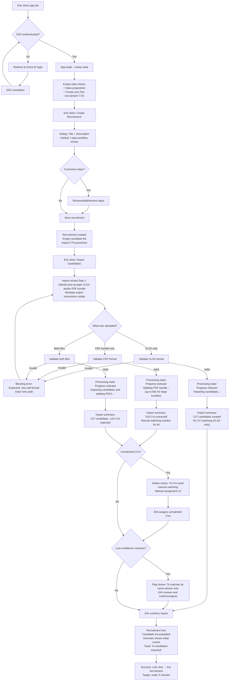
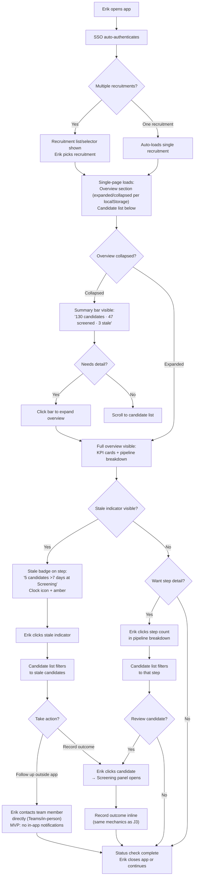
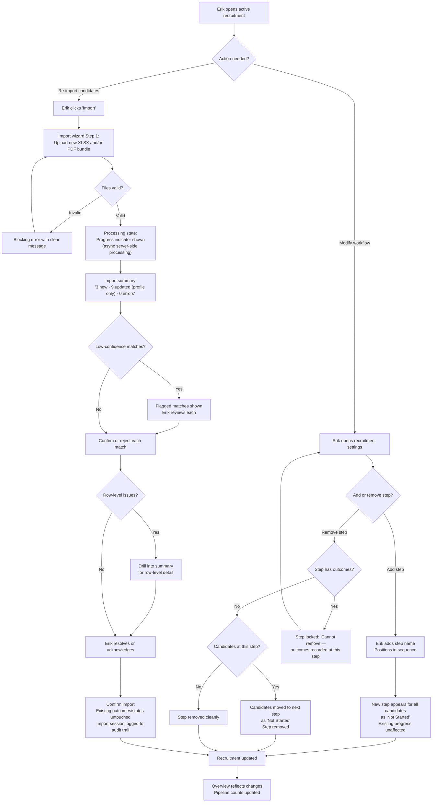
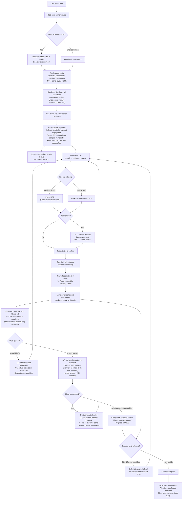
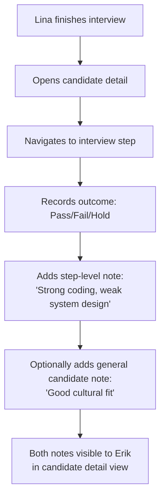
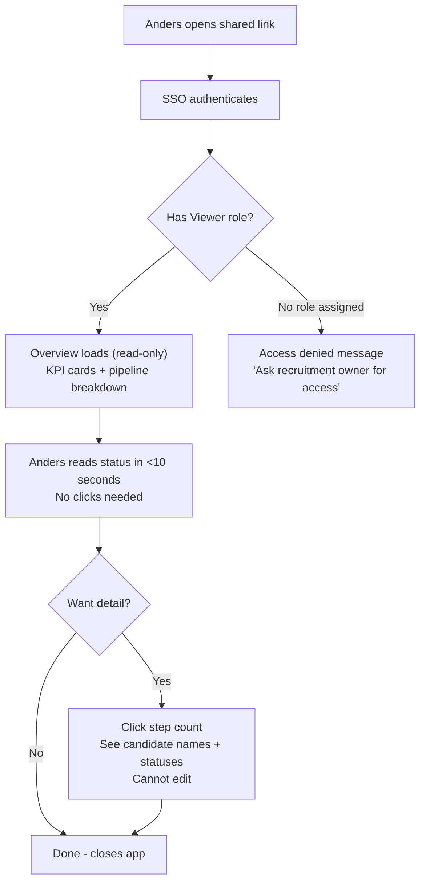
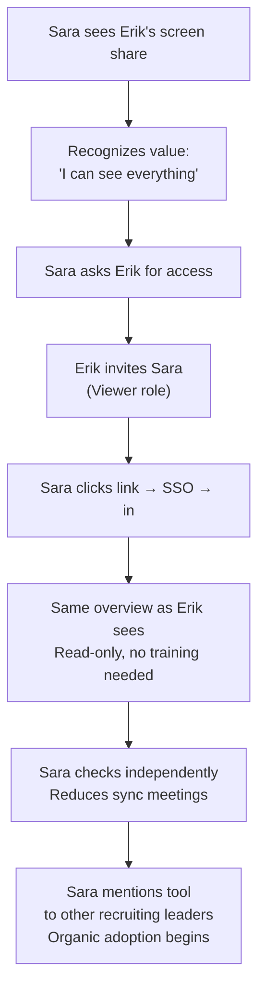

# User Journey Flows

## J0: Erik's First Five Minutes (Onboarding)

The zero-to-live journey. Erik arrives at an empty app and needs to leave with a functioning recruitment.

**Key design decisions:**
- Empty state is functional guidance, not a tutorial overlay
- Three independent upload paths: XLSX only, PDF only, or both together (per FR14)
- Explicit async processing state with progress indicator between upload and summary (per NFR6/NFR7 -- XLSX up to 10s, PDF split up to 60s)
- Blocking errors (invalid format) are prominent and stop the process
- Non-blocking issues (unmatched CVs, low-confidence matches) use amber tones and let Erik continue
- Workday export instructions embedded in the import wizard, not in separate docs

## J1: Erik's Daily Status Check

Erik opens the app between meetings to understand pipeline state without asking anyone.

**Key design decisions:**
- Recruitment selection when user has multiple recruitments (per FR13)
- The overview remembers its collapse state -- Lina keeps it collapsed, Erik keeps it expanded
- Collapsed state still shows key numbers inline (not just a toggle button)
- Clicking pipeline step counts filters the candidate list below -- no page transition
- Stale candidate follow-up explicitly outside the app in MVP -- the app provides awareness, not action tooling for notifications

## J2: Erik's Import & Workflow Modification

Mid-recruitment disruption: re-import candidates and modify workflow steps.

**Key design decisions:**
- Re-import is safe by default: never overwrites app-side data, never deletes candidates
- Explicit async processing state between upload and summary
- Import summary distinguishes new vs. updated with drill-down for details
- Step removal blocked if outcomes exist (FR12) -- protective constraint, not an error
- Step removal with candidates present: candidates move to next step as "Not Started"

## J3: Lina's Batch Screening Session

The make-or-break flow. This is where the app proves its value.

**Key design decisions:**
- Recruitment selection entry point when Lina has multiple recruitments (per FR13)
- Three-panel layout is always present (empty states before first selection, no layout shift)
- Keyboard shortcuts scoped: `1`/`2`/`3` only active when focus is on outcome panel, not in text fields
- Dual progress: total ("47 of 130") + session ("12 this session")
- Auto-advance follows the current sort order, wraps to top if no unscreened below
- Filtered list update timing: screened candidate exits filtered list *after* auto-advance completes, preventing visual disruption
- Undo window (3 seconds) eliminates need for confirmation dialogs; undo restores candidate in filtered list
- Overview update latency: ~3-4 seconds between outcome recording and overview reflection (undo window + API roundtrip). Acceptable for MVP's 3-6 concurrent users.
- CV pre-fetching makes transitions feel instant

## J4: Lina's Technical Interview Assessment (Growth -- Sketch)

**What this adds over MVP:** Step-level notes (evaluation-specific) and general candidate notes (holistic). The outcome recording mechanics remain identical to J3.

## J5: Anders's Passive Monitoring (Growth -- Sketch)

**What this adds over MVP:** Viewer role with read-only access. The overview UI is identical -- the difference is permission enforcement.

## J6: Sara's Viewer Validation (Growth -- Sketch)

**What this validates:** The overview is screen-shareable and self-explanatory. SSO removes all friction for new users. The "pull" adoption model works when the interface speaks for itself.

## Journey Patterns

Across all flows, these reusable patterns emerge:

**Navigation Patterns:**
- **Recruitment selection:** Header breadcrumb doubles as recruitment selector when multiple recruitments exist. Rare interaction but must be discoverable.
- **Filter-in-place:** Clicking overview elements (step counts, stale indicators) filters the candidate list without page transitions. The list is the universal navigation surface.
- **Persistent layout:** The three-panel structure is always present. Selection populates panels; deselection shows empty states. No layout shifts.

**Decision Patterns:**
- **Inline decisions:** All decisions (outcome recording, import confirmation, match review) happen inline without modal interrupts. The only dialog is recruitment creation -- a one-time setup action.
- **Reversible actions with graceful list updates:** Outcome recording uses optimistic UI + 3-second undo instead of confirmation dialogs. When a filtered list is active, the screened candidate exits the list *after* auto-advance completes, preventing visual disruption. Undo restores the candidate to its position.

**Feedback Patterns:**
- **Bottom-right toast notifications:** All confirmations (outcome recorded, import complete, recruitment created) use transient bottom-right toasts that auto-dismiss after 3 seconds. Never cover the working area.
- **Progressive error severity:** Blocking errors (invalid file) stop the process with prominent messaging. Non-blocking issues (unmatched CVs) use amber treatment and let the user continue.
- **Async processing visibility:** Import operations show explicit progress indicators during server-side processing. No instant-jump from upload to summary -- the user sees the system working.

**Entry Patterns:**
- **Zero-friction authentication:** SSO handles everything. No registration, no password, no email verification.
- **Context preservation:** The app remembers overview collapse state, panel sizes, and recruitment selection via localStorage. Return visits restore the user's preferred configuration.

**Latency Patterns:**
- **Optimistic UI with delayed persistence:** Outcomes appear immediately in the local UI. Server persistence occurs after the 3-second undo window. Overview updates reflect ~3-4 seconds after the action. This is acceptable for MVP's 3-6 concurrent users and should be documented for testers.

## Flow Optimization Principles

1. **Minimize steps to value:** Erik goes from link-click to live recruitment in under 5 minutes. Lina goes from app-open to CV-on-screen in under 10 seconds. Every extra click is scrutinized.

2. **Reduce cognitive load at decision points:** Outcome recording offers exactly three choices (Pass/Fail/Hold) with an optional reason. Import summary shows counts with drill-down available but not forced. Decisions are simple; detail is on-demand.

3. **Provide clear progress indicators:** Screening shows dual progress (total + session). Import wizard shows processing state with progress feedback. The overview itself is a progress indicator for the entire recruitment.

4. **Handle errors as guidance:** Blocking errors explain what happened and what to do next. Non-blocking issues use specific counts and clear resolution paths. The tone is "here's what needs your attention" not "something went wrong."

5. **Design for the return visit:** First-visit flows (J0) are guided with empty states and CTAs. Return-visit flows (J1, J3) are fast with preserved preferences. The app optimizes for the repeated action (screening, status checking) because that's where cumulative time is spent.

6. **Account for async operations:** Import processing is not instant for large datasets. The UX must show processing state with progress rather than blocking the UI or jumping to results prematurely.

7. **Graceful list transitions:** When filtering is active, list membership changes (candidate screened → exits "unscreened" filter) happen after navigation completes, never during. Visual stability during rapid-fire screening is essential for flow state.
